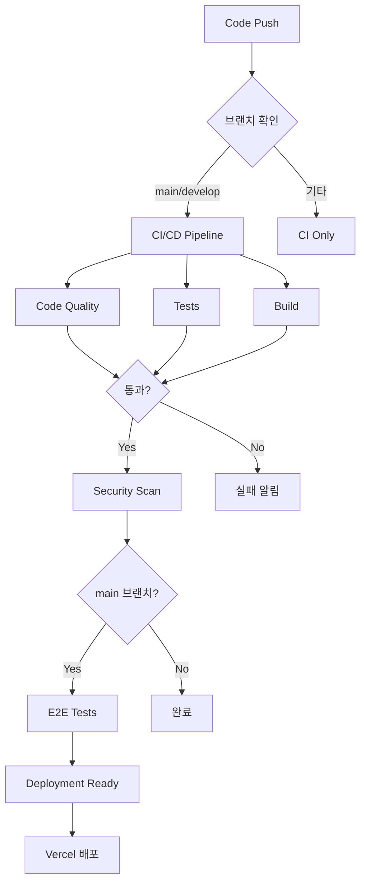

# CI/CD 파이프라인 가이드

SR Management System의 CI/CD 파이프라인 구성 및 사용 방법을 안내합니다.

## 📋 목차

1. [워크플로우 개요](#워크플로우-개요)
2. [CI/CD 파이프라인 구조](#cicd-파이프라인-구조)
3. [워크플로우 상세](#워크플로우-상세)
4. [배포 프로세스](#배포-프로세스)
5. [문제 해결](#문제-해결)

---

## 워크플로우 개요

현재 프로젝트는 다음 6개의 GitHub Actions 워크플로우를 사용합니다:

| 워크플로우 | 트리거 | 목적 | 소요 시간 |
|-----------|--------|------|----------|
| `ci-cd.yml` | Push/PR (main, develop) | 전체 CI/CD 파이프라인 | ~10분 |
| `ci.yml` | Push/PR | 빠른 코드 검증 | ~3분 |
| `deploy.yml` | Push (main, dev) | Vercel 배포 | ~5분 |
| `e2e.yml` | Push (main) | E2E 테스트 | ~15분 |
| `prewarm.yml` | Scheduled | 서버 예열 | ~1분 |
| `scheduled-checks.yml` | Daily 00:00 UTC | 정기 품질 점검 | ~8분 |

---

## CI/CD 파이프라인 구조



---

## 워크플로우 상세

### 1. CI/CD Pipeline (`ci-cd.yml`)

**트리거**: Push/PR to `main`, `develop`

**작업 순서**:
1. **Code Quality** (병렬)
   - ESLint 실행
   - TypeScript 타입 체크

2. **Tests** (병렬)
   - 단위 테스트 실행
   - 통합 테스트 실행
   - 커버리지 리포트 생성

3. **Build** (depends on 1, 2)
   - Next.js 빌드
   - 빌드 아티팩트 검증

4. **E2E Tests** (main 브랜치만)
   - Playwright E2E 테스트
   - 테스트 리포트 업로드

5. **Security Scan** (병렬)
   - npm audit
   - Trivy 취약점 스캔

6. **Deployment Ready** (main 브랜치만)
   - 모든 체크 통과 확인
   - 배포 준비 완료 알림

### 2. Quick CI (`ci.yml`)

**트리거**: 모든 Push/PR

빠른 검증만 수행:
- Lint
- Type check
- 기본 빌드

### 3. Deploy (`deploy.yml`)

**트리거**: Push to `main` (Production), `dev` (Preview)

**작업**:
1. Prisma Client 생성
2. Database 마이그레이션 (Production만)
3. Vercel 배포
4. 배포 URL 코멘트

### 4. E2E Tests (`e2e.yml`)

**트리거**: Push to `main`

**작업**:
- Playwright 브라우저 설치
- E2E 테스트 실행 (20개 시나리오)
- 테스트 리포트 및 스크린샷 업로드

### 5. Scheduled Checks (`scheduled-checks.yml`)

**트리거**: 매일 00:00 UTC (또는 수동)

**작업**:
- 의존성 업데이트 확인
- 보안 감사
- 번들 크기 분석
- 성능 벤치마크

---

## 배포 프로세스

### Production 배포 (main 브랜치)

```bash
# 1. 개발 완료 후 main에 병합
git checkout main
git merge develop

# 2. 자동으로 실행되는 작업:
#    - CI/CD 파이프라인 (코드 품질, 테스트, 빌드)
#    - E2E 테스트
#    - Database 마이그레이션
#    - Vercel Production 배포

# 3. 배포 완료 확인
#    - GitHub Actions 탭에서 워크플로우 상태 확인
#    - Vercel Dashboard에서 배포 로그 확인
#    - Production URL 접속하여 동작 확인
```

### Preview 배포 (dev 브랜치)

```bash
# 1. dev 브랜치에 Push
git push origin dev

# 2. 자동으로 실행되는 작업:
#    - CI/CD 파이프라인
#    - Vercel Preview 배포

# 3. Preview URL 확인
#    - PR 코멘트에서 Preview URL 확인
#    - 또는 Vercel Dashboard에서 확인
```

---

## GitHub Secrets 설정

CI/CD 파이프라인 실행을 위해 다음 Secrets가 필요합니다:

[SECRETS_SETUP.md](./SECRETS_SETUP.md) 파일을 참조하세요.

**필수 Secrets**:
- `DATABASE_URL`
- `DIRECT_URL`
- `TEST_DATABASE_URL`
- `NEXTAUTH_SECRET`
- `VERCEL_TOKEN`
- `VERCEL_ORG_ID`
- `VERCEL_PROJECT_ID`

---

## 문제 해결

### CI 실패 시

#### 1. Type Check 실패
```bash
# 로컬에서 확인
pnpm type-check

# 오류 수정 후 다시 Push
```

#### 2. 테스트 실패
```bash
# 실패한 테스트 로컬 실행
pnpm test

# 특정 테스트만 실행
pnpm test src/__tests__/path/to/test.test.ts
```

#### 3. 빌드 실패
```bash
# 로컬 빌드 확인
pnpm build

# 빌드 로그 확인
```

#### 4. E2E 테스트 실패
```bash
# 로컬 E2E 실행
pnpm test:e2e

# 특정 브라우저로 실행
pnpm test:e2e --project=chromium

# UI 모드로 디버깅
pnpm exec playwright test --ui
```

### 배포 실패 시

#### 1. Vercel 배포 실패
- Vercel Dashboard에서 로그 확인
- GitHub Actions 로그에서 에러 메시지 확인
- Secrets 설정 확인

#### 2. Database 마이그레이션 실패
```bash
# 로컬에서 마이그레이션 확인
pnpm prisma migrate dev

# 마이그레이션 상태 확인
pnpm prisma migrate status
```

#### 3. 환경 변수 오류
- `.env` 파일과 GitHub Secrets 동기화 확인
- Vercel Environment Variables 설정 확인

---

## 수동 워크플로우 실행

특정 워크플로우를 수동으로 실행하려면:

1. GitHub 저장소 → **Actions** 탭
2. 실행할 워크플로우 선택
3. **Run workflow** 버튼 클릭
4. 브랜치 선택 후 **Run workflow** 확인

---

## 성능 최적화 팁

### 1. 캐시 활용
- `pnpm` 패키지 캐시 사용 (이미 적용됨)
- Docker layer 캐시 (향후 Docker 사용 시)

### 2. 병렬 실행
- Code Quality와 Tests는 병렬 실행
- 의존성 없는 작업은 최대한 병렬 처리

### 3. 조건부 실행
- E2E 테스트는 main 브랜치만
- Database 마이그레이션은 Production 배포 시만

---

## 모범 사례

✅ **Do**:
- PR 생성 전에 로컬에서 `pnpm type-check`, `pnpm test` 실행
- Commit 메시지를 명확하게 작성
- CI 실패 시 즉시 수정
- Security scan 결과 정기적으로 확인

❌ **Don't**:
- CI를 통과하지 않은 코드 병합
- Secrets를 코드에 하드코딩
- 테스트 없이 main 브랜치에 직접 Push
- CI 실패를 무시하고 재실행만 반복

---

## 모니터링

### GitHub Actions
- Actions 탭에서 워크플로우 실행 이력 확인
- 실패한 워크플로우는 빨간색으로 표시
- 각 Job의 로그 상세 확인 가능

### Vercel
- Vercel Dashboard에서 배포 상태 모니터링
- 배포 히스토리 및 롤백 기능 제공
- 빌드 로그 및 런타임 로그 확인

### Codecov (선택사항)
- 코드 커버리지 트렌드 확인
- PR별 커버리지 변화 확인

---

## 추가 리소스

- [GitHub Actions 문서](https://docs.github.com/en/actions)
- [Vercel 배포 문서](https://vercel.com/docs/deployments/overview)
- [Playwright 문서](https://playwright.dev/docs/intro)
- [SECRETS_SETUP.md](./SECRETS_SETUP.md) - Secrets 설정 가이드

---

**업데이트**: 2025-11-28  
**관리자**: DevOps Team
