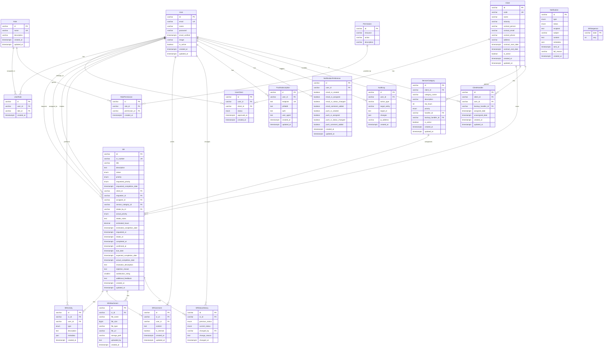

# SR Management System - Database Design Document

**문서 종류:** DB
**문서 버전:** 1.4
**작성일:** 2025-11-06
**최종 수정일:** 2026-07-30
**작성자:** Development Team
**검수자:** [검수자 정보]

---

## ⚠️ 중요 안내

**본 문서는 데이터베이스 구조를 설명하는 문서이며, 기계적으로 검증되는 정의 원본은
`prisma/schema.prisma` 와 `prisma/migrations/` 입니다.**

CI(`.github/workflows/ci-cd.yml`)가 `prisma migrate deploy` 후
`prisma migrate diff --exit-code` 로 두 원본의 일치를 강제한다. 본 문서는 이 두 원본을
사람이 읽을 수 있게 설명하는 계층이며, 둘이 어긋나면 **항상 스키마/마이그레이션이 옳다.**

다른 문서(PRD, TRD, LLD)에서 데이터베이스 관련 내용이 필요한 경우 본 문서를 참조하세요.

> **⚠️ 2026-07-30 정정.** 이 문서 1.3 이하 버전은 초기 설계안의 스택(Supabase PostgreSQL,
> PgBouncer 커넥션 풀러, Vercel Blob)을 사실처럼 기술하고 있었다. **그중 어느 것도 채택되지
> 않았다.** 또한 실제 스키마와 다음과 같이 어긋나 있었다.
>
> - 이미 삭제된 테이블(`accounts`, `sessions`, `verification_tokens`)을 존재하는 것으로 기술
> - 이미 삭제된 컬럼(`srs.attachment_count`, `srs.comment_count`)을 기술
> - `permissions` 테이블 구조가 실제(`permissions` + `role_permissions` 2테이블)와 다름
> - 실재하는 테이블 6개(`service_categories`, `client_handlers`, `sr_status_history`,
>   `sr_sequences`, `audit_logs`, `role_permissions`)가 아예 누락
> - 역할 이름이 시드(`prisma/seed.ts`)와 불일치 (`SYSTEM_ADMIN`/`DEVELOPER` → 실제 `ADMIN`/`MANAGER`/`ENGINEER`)
> - `NotificationType.MATTERMOST` 및 `client_handlers.mattermost_id` (마이그레이션
>   `20260730000000_drop_mattermost` 에서 제거됨)
>
> 본 버전은 `prisma/schema.prisma`(494줄)와 `prisma/migrations/` 9개 마이그레이션을 직접
> 읽어 대조한 결과로 갱신했다.

---

## 📚 문서 간 참조 가이드

| 문서                                      | 역할              | 주요 내용                              |
| ----------------------------------------- | ----------------- | -------------------------------------- |
| **[PRD.md](SR_Management_System_PRD.md)** | 비즈니스 요구사항 | 기능 정의, 사용자 역할, SR 프로세스    |
| **[DB.md](DB.md)**                        | 데이터베이스 설계 | **Prisma 스키마, ERD, 테이블 명세** ⭐ |
| **[TRD.md](TRD.md)**                      | 기술 명세         | 아키텍처, 기술 스택, 배포 전략         |
| **[LLD.md](LLD.md)**                      | 구현 상세         | 코드, 컴포넌트, 테스트 전략            |

**권장 읽는 순서**: PRD → DB → TRD → LLD

---

## 문서 개정 이력

| 버전 | 작성자           | 변경 사항                                                                                                               | 작성일     | 검수자   |
| ---- | ---------------- | ----------------------------------------------------------------------------------------------------------------------- | ---------- | -------- |
| 1.0  | Development Team | DB 설계 초안 작성                                                                                                       | 2025-11-06 | [검수자] |
| 1.1  | Development Team | ENUM 정의 통합, 필드명 표준화, 상태 전이 정의 추가                                                                      | 2025-11-06 | [검수자] |
| 1.2  | Development Team | Single Source of Truth 명시, 문서 간 참조 가이드 추가                                                                   | 2025-11-07 | [검수자] |
| 1.3  | Development Team | SR 요청/접수 프로세스 분리를 위한 필드 추가 (요청자/접수자 역할 분리)                                                   | 2025-01-12 | [검수자] |
| 1.4  | Development Team | 미채택 스택(Supabase/PgBouncer/Vercel Blob) 서술 정정, 실제 스키마·마이그레이션과 전면 대조하여 테이블/ENUM/제약 재작성 | 2026-07-30 | [검수자] |

---

## 목차

1. [개요](#개요)
2. [데이터베이스 설계 원칙](#데이터베이스-설계-원칙)
3. [ERD (Entity Relationship Diagram)](#erd-entity-relationship-diagram)
4. [ENUM 정의](#enum-정의)
5. [테이블 명세](#테이블-명세)
6. [스키마 원본 (Prisma)](#스키마-원본-prisma)
7. [인덱스 전략](#인덱스-전략)
8. [제약 조건](#제약-조건)
9. [초기 데이터](#초기-데이터)
10. [마이그레이션 이력](#마이그레이션-이력)
11. [마이그레이션 가이드](#마이그레이션-가이드)

---

## 개요

### 데이터베이스 정보

| 항목              | 실제 값                                                                         |
| ----------------- | ------------------------------------------------------------------------------- |
| DBMS              | PostgreSQL 16 (`postgres:16-alpine` 컨테이너)                                   |
| 호스팅 형태       | 자체 호스팅. 앱과 같은 호스트의 Docker Compose 서비스(`db`). 관리형 서비스 아님 |
| 데이터 영속화     | Docker named volume `sr_db_data` → `/var/lib/postgresql/data`                   |
| 네트워크 노출     | 없음. 호스트 포트 미매핑, 앱은 내부 브리지 네트워크(`sr-net`)로만 접근          |
| Connection Pooler | **없음.** PgBouncer·Supabase Pooler·Prisma Data Proxy 모두 미사용               |
| Character Set     | UTF-8                                                                           |
| 타임스탬프 타입   | `timestamptz` (UTC 저장)                                                        |
| ORM               | Prisma 6.19 (`@prisma/client` + `prisma`)                                       |

정의는 `docker-compose.prod.yml` 의 `db` 서비스에 있다. `POSTGRES_USER` /
`POSTGRES_PASSWORD` 는 저장소에 두지 않고 배포 호스트의 `.env` 에서 compose 가 보간하며,
값이 비면 `:?` 문법으로 즉시 실패한다.

### 연결 정보

```bash
# 앱 컨테이너 → DB 컨테이너 (컨테이너 이름이 호스트명)
DATABASE_URL="postgresql://<user>:<password>@db:5432/sr_db?schema=public"

# 스키마에 datasource.directUrl 이 선언되어 있어 Prisma 가 이 변수를 요구한다.
# 커넥션 풀러가 없으므로 DATABASE_URL 과 같은 값을 넣는다(분리해야 할 이유가 없다).
DIRECT_URL="postgresql://<user>:<password>@db:5432/sr_db?schema=public"
```

> **주의:** 풀러가 없으므로 `?pgbouncer=true` 나 `connection_limit=1` 같은 풀러 전용
> 파라미터를 붙이면 안 된다. 최대 연결 수는 PostgreSQL 컨테이너의 기본
> `max_connections` 와 Prisma 클라이언트 기본 풀 크기에 그대로 지배된다
> (별도 튜닝값을 설정한 적 없음 — 실측 필요 항목).

### 데이터베이스 설계 원칙

1. **정규화:** 제3정규형(3NF) 준수
2. **명명 규칙:** snake_case (PostgreSQL 표준). Prisma 모델은 camelCase, `@map`/`@@map` 으로 매핑
3. **타임스탬프:** 모든 주요 테이블에 `created_at` 포함, 변경 가능한 테이블에 `updated_at`
4. **문자열 길이:** 무제한 `TEXT` 대신 용도별 `VARCHAR(n)` 사용 (마이그레이션 `20260623055403_db_optimization`)
5. **외래 키:** 참조 무결성 유지 (CASCADE / SET NULL / RESTRICT — [제약 조건](#제약-조건) 참조)
6. **인덱스:** 자주 조회되는 컬럼 및 실제 쿼리 패턴에 맞춘 복합 인덱스
7. **소프트 삭제:** 사용하지 않음. `deleted_at` 컬럼은 어떤 테이블에도 없다

---

## ERD (Entity Relationship Diagram)

### 전체 ERD


```mermaid
erDiagram
    User ||--o{ UserRole : has
    User ||--o{ UserClient : belongs_to
    User ||--o{ SR : requests
    User ||--o{ SR : assigned_to
    User ||--o{ SR : intakes
    User ||--o{ SRActivity : performs
    User ||--o{ SRComment : writes
    User ||--o{ SRStatusHistory : changes
    User ||--o{ PushSubscription : has
    User ||--o| NotificationPreference : has
    User ||--o{ AuditLog : triggers
    User ||--o{ ServiceCategory : handles
    User ||--o{ ClientHandler : is

    Role ||--o{ UserRole : assigned_to
    Role ||--o{ RolePermission : grants
    Permission ||--o{ RolePermission : granted_by

    Client ||--o{ UserClient : has
    Client ||--o{ SR : owns
    Client ||--o{ ServiceCategory : defines
    Client ||--o{ ClientHandler : has

    ServiceCategory ||--o{ SR : categorizes

    SR ||--o{ SRActivity : has
    SR ||--o{ SRComment : has
    SR ||--o{ SRAttachment : has
    SR ||--o{ SRStatusHistory : has

    User {
        varchar id PK
        varchar email UK
        varchar name
        varchar password
        timestamptz email_verified
        varchar image
        boolean is_active
        timestamptz created_at
        timestamptz updated_at
    }

    Role {
        varchar id PK
        varchar name UK
        varchar description
        timestamptz created_at
        timestamptz updated_at
    }

    UserRole {
        varchar id PK
        varchar user_id FK
        varchar role_id FK
        timestamptz created_at
    }

    Permission {
        varchar id PK
        varchar resource
        varchar action
        varchar description
    }

    RolePermission {
        varchar id PK
        varchar role_id FK
        varchar permission_id FK
        timestamptz created_at
    }

    Client {
        varchar id PK
        varchar code UK
        varchar name
        varchar industry
        varchar contact_person
        varchar contact_email
        varchar contact_phone
        varchar address
        timestamptz contract_start_date
        timestamptz contract_end_date
        boolean is_active
        timestamptz created_at
        timestamptz updated_at
    }

    UserClient {
        varchar id PK
        varchar user_id FK
        varchar client_id FK
        enum status
        timestamptz approved_at
        timestamptz created_at
    }

    ServiceCategory {
        varchar id PK
        varchar client_id FK
        varchar category_name
        varchar description
        int sla_hours
        enum priority
        varchar handler_id FK
        varchar backup_handler_id FK
        boolean is_active
        timestamptz created_at
        timestamptz updated_at
    }

    ClientHandler {
        varchar id PK
        varchar client_id FK
        varchar user_id FK
        varchar backup_handler_id FK
        timestamptz assigned_date
        timestamptz unassigned_date
        timestamptz created_at
        timestamptz updated_at
    }

    SR {
        varchar id PK
        varchar sr_number UK
        varchar title
        text description
        enum status
        enum priority
        enum requested_priority
        timestamptz requested_completion_date
        varchar client_id FK
        varchar requester_id FK
        varchar assignee_id FK
        varchar service_category_id FK
        varchar intake_by_id FK
        enum actual_priority
        text intake_notes
        decimal estimated_hours
        timestamptz estimated_completion_date
        timestamptz requested_at
        timestamptz intake_at
        timestamptz completed_at
        timestamptz confirmed_at
        timestamptz due_date
        timestamptz expected_completion_date
        timestamptz actual_completion_date
        text resolution_description
        text rejection_reason
        smallint satisfaction_rating
        text additional_feedback
        timestamptz created_at
        timestamptz updated_at
    }

    SRActivity {
        varchar id PK
        varchar sr_id FK
        varchar user_id FK
        enum type
        text description
        json metadata
        timestamptz created_at
    }

    SRComment {
        varchar id PK
        varchar sr_id FK
        varchar user_id FK
        text content
        boolean is_internal
        timestamptz created_at
        timestamptz updated_at
    }

    SRAttachment {
        varchar id PK
        varchar sr_id FK
        varchar file_name
        bigint file_size
        varchar file_type
        varchar file_url
        varchar storage_path
        text uploaded_by
        timestamptz created_at
    }

    SRStatusHistory {
        varchar id PK
        varchar sr_id FK
        enum previous_status
        enum current_status
        varchar changed_by FK
        text change_reason
        timestamptz changed_at
    }

    Notification {
        varchar id PK
        enum type
        enum status
        text recipient
        varchar subject
        text content
        json metadata
        timestamptz sent_at
        varchar fail_reason
        timestamptz created_at
    }

    PushSubscription {
        varchar id PK
        varchar user_id FK
        text endpoint UK
        text p256dh
        text auth
        text user_agent
        timestamptz created_at
        timestamptz updated_at
    }

    NotificationPreference {
        varchar id PK
        varchar user_id FK
        boolean email_sr_created
        boolean email_sr_assigned
        boolean email_sr_status_changed
        boolean email_comment_added
        boolean push_sr_created
        boolean push_sr_assigned
        boolean push_sr_status_changed
        boolean push_comment_added
        timestamptz created_at
        timestamptz updated_at
    }

    SRSequence {
        varchar date PK
        int seq
    }

    AuditLog {
        varchar id PK
        varchar user_id FK
        varchar action_type
        varchar target_entity
        text target_id
        json changes
        varchar ip_address
        timestamptz created_at
    }
```

> `Notification` 과 `SRSequence` 는 다른 테이블과 FK 관계가 없어 위 ERD 관계선에
> 나타나지 않는다. `Notification` 의 현재 상태는
> [14. notifications](#14-notifications-알림-outbox--미사용) 를 반드시 읽을 것.

### 도메인별 ERD

#### 1. 인증 및 사용자 관리

세션은 DB에 저장되지 않는다(Auth.js v5 JWT 전략). 따라서 `accounts` / `sessions` /
`verification_tokens` 테이블은 **존재하지 않는다** (마이그레이션
`20260623081611_remove_unused_auth_tables` 에서 삭제).

```
┌─────────────┐
│    User     │
├─────────────┤
│ id (PK)     │
│ email (UK)  │
│ name        │
│ password    │  ← bcryptjs 해시
│ is_active   │
└─────────────┘
       │
       ├────────────► UserClient ────► Client   (소속 + 승인 상태)
       │
       └────────────► UserRole
                          │
                          ▼
                     ┌─────────┐      ┌──────────────────┐      ┌──────────────┐
                     │  Role   │─────►│ RolePermission   │◄─────│ Permission   │
                     ├─────────┤      ├──────────────────┤      ├──────────────┤
                     │ id (PK) │      │ role_id (FK)     │      │ resource     │
                     │ name UK │      │ permission_id FK │      │ action       │
                     └─────────┘      └──────────────────┘      └──────────────┘
```

권한은 역할에 직접 매달린 행이 아니라, 전역 `permissions` 카탈로그(`(resource, action)`
유니크)와 `role_permissions` 매핑 테이블의 조합이다.

#### 2. SR 관리

```
┌─────────────┐
│     SR      │
├─────────────┤
│ id (PK)     │
│ sr_number   │  ← SR-YYYYMMDD-NNNN (sr_sequences 에서 원자적 채번)
│ title       │
│ status      │
│ priority    │
│ client_id   │───────► Client
│ requester   │───────► User
│ assignee    │───────► User
│ intake_by   │───────► User
│ category    │───────► ServiceCategory (SLA 시간 보유)
└─────────────┘
       │
       ├──────────► SRActivity        (활동 로그)
       ├──────────► SRComment         (댓글, is_internal 구분)
       ├──────────► SRAttachment      (서버 디스크 파일 메타데이터)
       └──────────► SRStatusHistory   (상태 전이 이력)
```

---

## ENUM 정의

`prisma/schema.prisma` 기준. PostgreSQL 네이티브 enum 타입으로 생성된다.

| ENUM 타입            | 값                                                                                                                                                                                      | 사용 컬럼                                                                                |
| -------------------- | --------------------------------------------------------------------------------------------------------------------------------------------------------------------------------------- | ---------------------------------------------------------------------------------------- |
| `SRStatus`           | `REQUESTED`, `INTAKE`, `IN_PROGRESS`, `ON_HOLD`, `COMPLETED`, `CONFIRMED`, `REJECTED`                                                                                                   | `srs.status`, `sr_status_history.previous_status` / `current_status`                     |
| `SRPriority`         | `CRITICAL`, `HIGH`, `MEDIUM`, `LOW`                                                                                                                                                     | `srs.priority` / `requested_priority` / `actual_priority`, `service_categories.priority` |
| `SRActivityType`     | `CREATED`, `STATUS_CHANGED`, `PRIORITY_CHANGED`, `ASSIGNED`, `REASSIGNED`, `COMMENTED`, `ATTACHMENT_ADDED`, `ATTACHMENT_REMOVED`, `REOPENED`, `COMPLETED`, `REJECTED`, `INTAKE_UPDATED` | `sr_activities.type`                                                                     |
| `NotificationType`   | `EMAIL`, `IN_APP`, `PUSH`                                                                                                                                                               | `notifications.type`                                                                     |
| `NotificationStatus` | `PENDING`, `SENT`, `FAILED`                                                                                                                                                             | `notifications.status`                                                                   |
| `UserClientStatus`   | `PENDING`, `APPROVED`                                                                                                                                                                   | `user_clients.status`                                                                    |

**`NotificationType.MATTERMOST` 는 제거되었다** (마이그레이션
`20260730000000_drop_mattermost`). 매터모스트 연동은 구현된 적이 없으며, 제거 시점에
운영/스테이징 양쪽 모두 해당 값을 쓰는 행이 0건이었다.

### 우선순위와 SLA

우선순위 자체에는 시간이 붙어 있지 않다. SLA 시간은 **`service_categories.sla_hours`**
(정수, 시간 단위)에 카테고리별로 저장되며, `srs.due_date` 계산에 쓰인다.
초기 설계안이 우선순위에 하드코딩했던 4h/24h/72h/168h 값은 스키마에 존재하지 않는다.

---

## 테이블 명세

전체 16개 테이블. 아래 순서는 ERD 순서를 따른다.

### 1. users (사용자)

사용자 계정 정보를 저장하는 핵심 테이블

| 컬럼명         | 데이터 타입   | NULL | 기본값 | 설명                           |
| -------------- | ------------- | ---- | ------ | ------------------------------ |
| id             | VARCHAR(30)   | NO   | cuid() | 사용자 고유 ID (PK)            |
| email          | VARCHAR(255)  | NO   | -      | 이메일 주소 (UK)               |
| name           | VARCHAR(50)   | NO   | -      | 사용자 이름                    |
| password       | VARCHAR(255)  | NO   | -      | bcryptjs 해시 (work factor 12) |
| email_verified | TIMESTAMPTZ   | YES  | NULL   | 이메일 인증 시간 (미사용)      |
| image          | VARCHAR(1024) | YES  | NULL   | 프로필 이미지 URL              |
| is_active      | BOOLEAN       | NO   | true   | 활성화 상태                    |
| created_at     | TIMESTAMPTZ   | NO   | now()  | 생성 시간                      |
| updated_at     | TIMESTAMPTZ   | NO   | -      | 수정 시간 (`@updatedAt`)       |

**인덱스:** PK `id` / UNIQUE `email` / INDEX `email` / INDEX `is_active`

**제약 조건:** 이메일 형식은 애플리케이션(Zod)에서만 검증한다. DB CHECK 제약은 없다.

---

### 2. roles (역할)

사용자 역할 정의

| 컬럼명      | 데이터 타입  | NULL | 기본값 | 설명              |
| ----------- | ------------ | ---- | ------ | ----------------- |
| id          | VARCHAR(30)  | NO   | cuid() | 역할 고유 ID (PK) |
| name        | VARCHAR(50)  | NO   | -      | 역할 이름 (UK)    |
| description | VARCHAR(255) | YES  | NULL   | 역할 설명         |
| created_at  | TIMESTAMPTZ  | NO   | now()  | 생성 시간         |
| updated_at  | TIMESTAMPTZ  | NO   | -      | 수정 시간         |

**인덱스:** PK `id` / UNIQUE `name`

**시드로 생성되는 역할** (`prisma/seed.ts`):

- `ADMIN`: 시스템 관리자 - 모든 권한
- `MANAGER`: 매니저 - SR 관리 및 사용자 관리
- `ENGINEER`: 엔지니어 - SR 처리
- `CLIENT_ADMIN`: 고객사 관리자 - 자사 SR 관리
- `CLIENT_USER`: 고객사 사용자 - SR 생성 및 조회

---

### 3. user_roles (사용자-역할 매핑)

| 컬럼명     | 데이터 타입 | NULL | 기본값 | 설명              |
| ---------- | ----------- | ---- | ------ | ----------------- |
| id         | VARCHAR(30) | NO   | cuid() | 매핑 고유 ID (PK) |
| user_id    | VARCHAR(30) | NO   | -      | 사용자 ID (FK)    |
| role_id    | VARCHAR(30) | NO   | -      | 역할 ID (FK)      |
| created_at | TIMESTAMPTZ | NO   | now()  | 생성 시간         |

**인덱스:** PK `id` / UNIQUE `(user_id, role_id)` / INDEX `role_id`
(`user_id` 단독 인덱스는 없다 — 유니크 인덱스의 선행 컬럼이라 불필요)

**외래 키:** `user_id` → `users(id)` CASCADE, `role_id` → `roles(id)` CASCADE

---

### 4. permissions (권한 카탈로그)

역할과 무관한 전역 권한 목록

| 컬럼명      | 데이터 타입  | NULL | 기본값 | 설명                                      |
| ----------- | ------------ | ---- | ------ | ----------------------------------------- |
| id          | VARCHAR(30)  | NO   | cuid() | 권한 고유 ID (PK)                         |
| resource    | VARCHAR(50)  | NO   | -      | 리소스 (`SR`, `CLIENT`, `USER` 등 대문자) |
| action      | VARCHAR(50)  | NO   | -      | 액션 (`CREATE`, `READ`, `UPDATE` 등)      |
| description | VARCHAR(255) | YES  | NULL   | 권한 설명                                 |

**인덱스:** PK `id` / UNIQUE `(resource, action)`

**권한 형식:** `resource` 와 `action` 모두 **대문자**다 (`SR` + `CREATE`).
시드가 정의하는 리소스: `SR`, `CLIENT`, `USER`, `ROLE`, `COMMENT`, `ATTACHMENT`,
`NOTIFICATION`, `DASHBOARD`.

---

### 5. role_permissions (역할-권한 매핑)

| 컬럼명        | 데이터 타입 | NULL | 기본값 | 설명              |
| ------------- | ----------- | ---- | ------ | ----------------- |
| id            | VARCHAR(30) | NO   | cuid() | 매핑 고유 ID (PK) |
| role_id       | VARCHAR(30) | NO   | -      | 역할 ID (FK)      |
| permission_id | VARCHAR(30) | NO   | -      | 권한 ID (FK)      |
| created_at    | TIMESTAMPTZ | NO   | now()  | 생성 시간         |

**인덱스:** PK `id` / UNIQUE `(role_id, permission_id)` / INDEX `permission_id`

**외래 키:** `role_id` → `roles(id)` CASCADE, `permission_id` → `permissions(id)` CASCADE

---

### 6. clients (고객사)

| 컬럼명              | 데이터 타입  | NULL | 기본값 | 설명                         |
| ------------------- | ------------ | ---- | ------ | ---------------------------- |
| id                  | VARCHAR(30)  | NO   | cuid() | 고객사 고유 ID (PK)          |
| code                | VARCHAR(50)  | NO   | -      | 고객사 코드 (UK, 예: `ACME`) |
| name                | VARCHAR(100) | NO   | -      | 고객사 이름                  |
| industry            | VARCHAR(100) | YES  | NULL   | 업종                         |
| contact_person      | VARCHAR(50)  | YES  | NULL   | 담당자 이름                  |
| contact_email       | VARCHAR(255) | YES  | NULL   | 담당자 이메일                |
| contact_phone       | VARCHAR(30)  | YES  | NULL   | 담당자 전화번호              |
| address             | VARCHAR(500) | YES  | NULL   | 주소                         |
| contract_start_date | TIMESTAMPTZ  | YES  | NULL   | 계약 시작일 (`DATE` 아님)    |
| contract_end_date   | TIMESTAMPTZ  | YES  | NULL   | 계약 종료일 (`DATE` 아님)    |
| is_active           | BOOLEAN      | NO   | true   | 활성화 상태                  |
| created_at          | TIMESTAMPTZ  | NO   | now()  | 생성 시간                    |
| updated_at          | TIMESTAMPTZ  | NO   | -      | 수정 시간                    |

**인덱스:** PK `id` / UNIQUE `code` / INDEX `name` / INDEX `code` / INDEX `is_active`

> `code` 에 대한 schema.prisma 주석은 "SR 번호 생성에 사용되는 고유 코드"라고 적혀 있으나,
> **현재 SR 번호 생성 로직(`src/services/sr.service.ts`)은 `code` 를 사용하지 않는다.**
> 번호는 고객사와 무관한 일자별 전역 시퀀스다. 아래 `sr_sequences` 참조.

---

### 7. user_clients (사용자-고객사 소속)

| 컬럼명      | 데이터 타입        | NULL | 기본값     | 설명              |
| ----------- | ------------------ | ---- | ---------- | ----------------- |
| id          | VARCHAR(30)        | NO   | cuid()     | 매핑 고유 ID (PK) |
| user_id     | VARCHAR(30)        | NO   | -          | 사용자 ID (FK)    |
| client_id   | VARCHAR(30)        | NO   | -          | 고객사 ID (FK)    |
| status      | `UserClientStatus` | NO   | `APPROVED` | 소속 승인 상태    |
| approved_at | TIMESTAMPTZ        | YES  | NULL       | 승인 시간         |
| created_at  | TIMESTAMPTZ        | NO   | now()      | 생성 시간         |

**인덱스:** PK `id` / UNIQUE `(user_id, client_id)` / INDEX `client_id` / INDEX `status`

**외래 키:** `user_id` → `users(id)` CASCADE, `client_id` → `clients(id)` CASCADE

**설계 의도** (마이그레이션 `20260703020000_user_client_approval`): 관리자/운영자가 직접
배정한 소속은 신뢰할 수 있으므로 기본값이 `APPROVED` 이며, **셀프 회원가입으로 생성되는
소속만 `PENDING`** 으로 만들어 승인 전까지 크로스 테넌트 데이터 접근을 차단한다.
마이그레이션 시 기존 소속은 모두 승인된 것으로 백필했다.

---

### 8. service_categories (서비스 카테고리 / SLA)

SR 분류와 SLA 시간, 기본 담당자를 정의한다.

| 컬럼명            | 데이터 타입  | NULL | 기본값   | 설명                                 |
| ----------------- | ------------ | ---- | -------- | ------------------------------------ |
| id                | VARCHAR(30)  | NO   | cuid()   | 카테고리 고유 ID (PK)                |
| client_id         | VARCHAR(30)  | YES  | NULL     | 고객사 ID (FK). NULL = 공용 카테고리 |
| category_name     | VARCHAR(100) | NO   | -        | 카테고리 이름                        |
| description       | VARCHAR(255) | YES  | NULL     | 설명                                 |
| sla_hours         | INTEGER      | NO   | -        | SLA 시간 (시간 단위)                 |
| priority          | `SRPriority` | NO   | `MEDIUM` | 기본 우선순위                        |
| handler_id        | VARCHAR(30)  | YES  | NULL     | 기본 담당자 ID (FK)                  |
| backup_handler_id | VARCHAR(30)  | YES  | NULL     | 대체 담당자 ID (FK)                  |
| is_active         | BOOLEAN      | NO   | true     | 활성화 상태                          |
| created_at        | TIMESTAMPTZ  | NO   | now()    | 생성 시간                            |
| updated_at        | TIMESTAMPTZ  | NO   | -        | 수정 시간                            |

**인덱스:** PK `id` / INDEX `client_id` / INDEX `handler_id`

**외래 키:** `client_id` → `clients(id)` SET NULL, `handler_id` → `users(id)` SET NULL,
`backup_handler_id` → `users(id)` SET NULL

---

### 9. client_handlers (고객사 담당자 배정)

| 컬럼명            | 데이터 타입 | NULL | 기본값 | 설명                |
| ----------------- | ----------- | ---- | ------ | ------------------- |
| id                | VARCHAR(30) | NO   | cuid() | 배정 고유 ID (PK)   |
| client_id         | VARCHAR(30) | NO   | -      | 고객사 ID (FK)      |
| user_id           | VARCHAR(30) | NO   | -      | 담당자 ID (FK)      |
| backup_handler_id | VARCHAR(30) | YES  | NULL   | 대체 담당자 ID (FK) |
| assigned_date     | TIMESTAMPTZ | NO   | now()  | 배정일              |
| unassigned_date   | TIMESTAMPTZ | YES  | NULL   | 배정 해제일         |
| created_at        | TIMESTAMPTZ | NO   | now()  | 생성 시간           |
| updated_at        | TIMESTAMPTZ | NO   | -      | 수정 시간           |

**인덱스:** PK `id` / UNIQUE `(client_id, user_id)` / INDEX `user_id`

**외래 키:** `client_id` → `clients(id)` RESTRICT, `user_id` → `users(id)` RESTRICT,
`backup_handler_id` → `users(id)` SET NULL

> `mattermost_id` 컬럼은 제거되었다 (마이그레이션 `20260730000000_drop_mattermost`).
> 제거 시점에 운영/스테이징 양쪽 모두 이 테이블은 0행이었다.

---

### 10. srs (SR - Service Request)

| 컬럼명                    | 데이터 타입    | NULL | 기본값      | 설명                                  |
| ------------------------- | -------------- | ---- | ----------- | ------------------------------------- |
| id                        | VARCHAR(30)    | NO   | cuid()      | SR 고유 ID (PK)                       |
| sr_number                 | VARCHAR(30)    | NO   | -           | SR 번호 (UK, 형식 `SR-20260730-0001`) |
| title                     | VARCHAR(255)   | NO   | -           | SR 제목                               |
| description               | TEXT           | NO   | -           | SR 상세 설명                          |
| status                    | `SRStatus`     | NO   | `REQUESTED` | 상태                                  |
| priority                  | `SRPriority`   | NO   | `MEDIUM`    | 우선순위                              |
| requested_priority        | `SRPriority`   | NO   | `MEDIUM`    | 요청자 희망 우선순위                  |
| requested_completion_date | TIMESTAMPTZ    | YES  | NULL        | 요청자 희망 완료일                    |
| client_id                 | VARCHAR(30)    | NO   | -           | 고객사 ID (FK)                        |
| requester_id              | VARCHAR(30)    | NO   | -           | 요청자 ID (FK)                        |
| assignee_id               | VARCHAR(30)    | YES  | NULL        | 담당자 ID (FK)                        |
| service_category_id       | VARCHAR(30)    | NO   | -           | 서비스 카테고리 ID (FK)               |
| intake_by_id              | VARCHAR(30)    | YES  | NULL        | 접수 처리자 ID (FK)                   |
| actual_priority           | `SRPriority`   | YES  | NULL        | 실제 우선순위 (접수자 결정)           |
| intake_notes              | TEXT           | YES  | NULL        | 접수 메모/분석 내용                   |
| estimated_hours           | DECIMAL(10, 2) | YES  | NULL        | 예상 작업 시간 (`FLOAT` 아님)         |
| estimated_completion_date | TIMESTAMPTZ    | YES  | NULL        | 접수자가 설정한 예상 완료일           |
| requested_at              | TIMESTAMPTZ    | NO   | now()       | 요청 시간                             |
| intake_at                 | TIMESTAMPTZ    | YES  | NULL        | 접수 시간                             |
| completed_at              | TIMESTAMPTZ    | YES  | NULL        | 완료 시간                             |
| confirmed_at              | TIMESTAMPTZ    | YES  | NULL        | 확인 완료 시간                        |
| due_date                  | TIMESTAMPTZ    | YES  | NULL        | 완료 목표 시간 (SLA 기준)             |
| expected_completion_date  | TIMESTAMPTZ    | YES  | NULL        | 예상 완료일                           |
| actual_completion_date    | TIMESTAMPTZ    | YES  | NULL        | 실제 완료일                           |
| resolution_description    | TEXT           | YES  | NULL        | 처리 결과 설명                        |
| rejection_reason          | TEXT           | YES  | NULL        | 거부 사유                             |
| satisfaction_rating       | SMALLINT       | YES  | NULL        | 만족도 평가 (CHECK: NULL 또는 1~5)    |
| additional_feedback       | TEXT           | YES  | NULL        | 추가 피드백                           |
| created_at                | TIMESTAMPTZ    | NO   | now()       | 생성 시간                             |
| updated_at                | TIMESTAMPTZ    | NO   | -           | 수정 시간                             |

**삭제된 컬럼:** `attachment_count`, `comment_count` 는 제거되었다
(마이그레이션 `20260703000000_drop_dead_sr_counters`). 두 스칼라는 어디서도 읽히지 않았고,
비트랜잭션 갱신으로 드리프트만 유발했다. 첨부/댓글 개수는 항상 Prisma `_count` 로 계산한다.

**인덱스:**

- PK `id` / UNIQUE `sr_number`
- INDEX `(client_id, status)`
- INDEX `(requester_id, created_at)`
- INDEX `(assignee_id, status)`
- INDEX `(service_category_id)`
- INDEX `(status, priority, created_at)`
- INDEX `(intake_by_id)`
- INDEX `(status, due_date)` — 마감일 큐/대시보드 (`20260630000000_add_sr_due_date_indexes`)
- INDEX `(assignee_id, due_date)` — 담당자별 마감 임박 (동일 마이그레이션)

**외래 키:**

- `client_id` → `clients(id)` RESTRICT
- `requester_id` → `users(id)` RESTRICT
- `assignee_id` → `users(id)` SET NULL
- `intake_by_id` → `users(id)` SET NULL
- `service_category_id` → `service_categories(id)` RESTRICT

**CHECK 제약:** `srs_satisfaction_rating_range`
(`satisfaction_rating IS NULL OR satisfaction_rating BETWEEN 1 AND 5`,
마이그레이션 `20260703010000_sr_constraints`)

---

### 11. sr_activities (SR 활동 내역)

| 컬럼명      | 데이터 타입      | NULL | 기본값 | 설명                          |
| ----------- | ---------------- | ---- | ------ | ----------------------------- |
| id          | VARCHAR(30)      | NO   | cuid() | 활동 고유 ID (PK)             |
| sr_id       | VARCHAR(30)      | NO   | -      | SR ID (FK)                    |
| user_id     | VARCHAR(30)      | NO   | -      | 수행자 ID (FK)                |
| type        | `SRActivityType` | NO   | -      | 활동 유형                     |
| description | TEXT             | NO   | -      | 활동 설명                     |
| metadata    | JSONB            | YES  | NULL   | 추가 정보 (이전 값, 새 값 등) |
| created_at  | TIMESTAMPTZ      | NO   | now()  | 생성 시간                     |

**인덱스:** PK `id` / INDEX `(sr_id, created_at DESC)` / INDEX `user_id`

`DESC` 정렬 인덱스는 마이그레이션 `20260619_improve_indexes_and_sorting` 에서
기존 오름차순 인덱스를 대체했다(목록은 항상 최신순 조회).

**외래 키:** `sr_id` → `srs(id)` CASCADE, `user_id` → `users(id)` RESTRICT

---

### 12. sr_comments (SR 댓글)

| 컬럼명      | 데이터 타입 | NULL | 기본값 | 설명              |
| ----------- | ----------- | ---- | ------ | ----------------- |
| id          | VARCHAR(30) | NO   | cuid() | 댓글 고유 ID (PK) |
| sr_id       | VARCHAR(30) | NO   | -      | SR ID (FK)        |
| user_id     | VARCHAR(30) | NO   | -      | 작성자 ID (FK)    |
| content     | TEXT        | NO   | -      | 댓글 내용         |
| is_internal | BOOLEAN     | NO   | false  | 내부 메모 여부    |
| created_at  | TIMESTAMPTZ | NO   | now()  | 생성 시간         |
| updated_at  | TIMESTAMPTZ | NO   | -      | 수정 시간         |

**인덱스:** PK `id` / INDEX `(sr_id, created_at DESC)` /
INDEX `(sr_id, is_internal, created_at DESC)` / INDEX `user_id`

`is_internal` 복합 인덱스는 고객사 사용자에게 내부 메모를 숨긴 목록 조회를 위한 것이다.

**외래 키:** `sr_id` → `srs(id)` CASCADE, `user_id` → `users(id)` RESTRICT

---

### 13. sr_attachments (SR 첨부파일)

SR의 첨부파일 메타데이터. **파일 실체는 서버 디스크에 저장된다.**

| 컬럼명       | 데이터 타입   | NULL | 기본값 | 설명                                    |
| ------------ | ------------- | ---- | ------ | --------------------------------------- |
| id           | VARCHAR(30)   | NO   | cuid() | 첨부파일 고유 ID (PK)                   |
| sr_id        | VARCHAR(30)   | NO   | -      | SR ID (FK)                              |
| file_name    | VARCHAR(255)  | NO   | -      | 원본 파일명                             |
| file_size    | BIGINT        | NO   | -      | 파일 크기 (bytes)                       |
| file_type    | VARCHAR(100)  | NO   | -      | MIME 타입                               |
| file_url     | VARCHAR(1024) | NO   | -      | `STORAGE_DIR` 기준 상대 경로            |
| storage_path | VARCHAR(1024) | YES  | NULL   | 저장 경로 (다운로드 라우트가 우선 사용) |
| uploaded_by  | TEXT          | NO   | -      | 업로드한 사용자 ID (**FK 제약 없음**)   |
| created_at   | TIMESTAMPTZ   | NO   | now()  | 생성 시간                               |

**인덱스:** PK `id` / INDEX `sr_id`

**외래 키:** `sr_id` → `srs(id)` CASCADE.
`uploaded_by` 는 사용자 ID 문자열이지만 **FK 제약이 없다** (참조 무결성 미보장).

**저장 위치 (실제):** 서버 디스크 `STORAGE_DIR`(운영: `/app/var/uploads`, Docker named
volume `sr_uploads`), 파일 경로는 `attachments/<srId>/<timestamp>-<safeName>` 형태다
(`src/lib/storage.ts`). 웹루트(`public/`) 밖에 저장되며 인증 라우트
`/api/attachments/[id]/download` 로만 스트리밍된다. 과거 `public/uploads` 에 업로드된
파일은 다운로드 시 폴백 경로로만 조회한다.

> **Vercel Blob 은 사용하지 않는다.** 오브젝트 스토리지·CDN 자체가 없다.
> `file_url` 은 공개 URL이 아니라 로컬 상대 경로다.

**파일 크기 제한:** 10MB. 애플리케이션 레벨(`src/app/api/attachments/route.ts` 의
`MAX_FILE_SIZE`)에서만 검증하며 **DB CHECK 제약은 없다.**

---

### 14. notifications (알림 outbox — 미사용)

> **⚠️ 이 테이블에는 어떤 코드도 행을 기록하지 않는다.**
> `src/` 전역에서 `prisma.notification.*` 호출이 0건이다(2026-07-30 확인).
> 테이블과 enum, 인덱스는 존재하지만 발송 이력/outbox 로 **동작하지 않는다.**
> 실제 알림 경로는 아래와 같이 DB를 거치지 않는다.
>
> - 이메일: nodemailer(SMTP) 로 도메인 이벤트 리스너에서 fire-and-forget
> - 웹 푸시: `web-push`(VAPID) + `push_subscriptions`
> - 실시간: 자체 SSE (`/api/realtime`)
>
> 따라서 발송 실패는 어디에도 영속 기록되지 않으며(로그만 남는다) 재시도도 없다.
> outbox 패턴을 실제로 쓰려면 쓰기 경로를 구현해야 한다.

| 컬럼명      | 데이터 타입          | NULL | 기본값    | 설명                           |
| ----------- | -------------------- | ---- | --------- | ------------------------------ |
| id          | VARCHAR(30)          | NO   | cuid()    | 알림 고유 ID (PK)              |
| type        | `NotificationType`   | NO   | -         | 알림 유형                      |
| status      | `NotificationStatus` | NO   | `PENDING` | 발송 상태                      |
| recipient   | TEXT                 | NO   | -         | 수신자 (이메일 또는 사용자 ID) |
| subject     | VARCHAR(255)         | YES  | NULL      | 제목                           |
| content     | TEXT                 | NO   | -         | 내용                           |
| metadata    | JSONB                | YES  | NULL      | 추가 정보                      |
| sent_at     | TIMESTAMPTZ          | YES  | NULL      | 발송 시간                      |
| fail_reason | VARCHAR(255)         | YES  | NULL      | 실패 사유                      |
| created_at  | TIMESTAMPTZ          | NO   | now()     | 생성 시간                      |

**인덱스:** PK `id` / INDEX `(status, created_at)` / INDEX `recipient` /
INDEX `(recipient, created_at)`

**외래 키:** 없음 (`recipient` 는 자유 문자열)

---

### 15. sr_status_history (SR 상태 전이 이력)

| 컬럼명          | 데이터 타입 | NULL | 기본값 | 설명                     |
| --------------- | ----------- | ---- | ------ | ------------------------ |
| id              | VARCHAR(30) | NO   | cuid() | 이력 고유 ID (PK)        |
| sr_id           | VARCHAR(30) | NO   | -      | SR ID (FK)               |
| previous_status | `SRStatus`  | YES  | NULL   | 이전 상태 (생성 시 NULL) |
| current_status  | `SRStatus`  | NO   | -      | 변경된 상태              |
| changed_by      | VARCHAR(30) | NO   | -      | 변경한 사용자 ID (FK)    |
| change_reason   | TEXT        | YES  | NULL   | 변경 사유                |
| changed_at      | TIMESTAMPTZ | NO   | now()  | 변경 시간                |

**인덱스:** PK `id` / INDEX `(sr_id, changed_at)` / INDEX `changed_by`

**외래 키:** `sr_id` → `srs(id)` CASCADE, `changed_by` → `users(id)` RESTRICT

---

### 16. push_subscriptions (웹 푸시 구독)

`web-push`(VAPID) 발송에 사용되는 브라우저 구독 정보

| 컬럼명     | 데이터 타입 | NULL | 기본값 | 설명                            |
| ---------- | ----------- | ---- | ------ | ------------------------------- |
| id         | VARCHAR(30) | NO   | cuid() | 구독 고유 ID (PK)               |
| user_id    | VARCHAR(30) | NO   | -      | 사용자 ID (FK)                  |
| endpoint   | TEXT        | NO   | -      | 푸시 서비스 엔드포인트 URL (UK) |
| p256dh     | TEXT        | NO   | -      | 암호화 키 (P256DH)              |
| auth       | TEXT        | NO   | -      | 인증 키 (Auth)                  |
| user_agent | TEXT        | YES  | NULL   | 구독한 브라우저/기기 정보       |
| created_at | TIMESTAMPTZ | NO   | now()  | 생성 시간                       |
| updated_at | TIMESTAMPTZ | NO   | -      | 수정 시간                       |

**인덱스:** PK `id` / UNIQUE `endpoint` / INDEX `user_id`

**외래 키:** `user_id` → `users(id)` CASCADE

---

### 17. notification_preferences (알림 설정)

사용자별 이메일 및 푸시 알림 수신 설정 (사용자당 1행)

| 컬럼명                  | 데이터 타입 | NULL | 기본값 | 설명                       |
| ----------------------- | ----------- | ---- | ------ | -------------------------- |
| id                      | VARCHAR(30) | NO   | cuid() | 설정 고유 ID (PK)          |
| user_id                 | VARCHAR(30) | NO   | -      | 사용자 ID (FK, UK)         |
| email_sr_created        | BOOLEAN     | NO   | true   | [이메일] 신규 SR 생성 알림 |
| email_sr_assigned       | BOOLEAN     | NO   | true   | [이메일] SR 담당 배정 알림 |
| email_sr_status_changed | BOOLEAN     | NO   | false  | [이메일] SR 상태 변경 알림 |
| email_comment_added     | BOOLEAN     | NO   | false  | [이메일] 새 댓글 알림      |
| push_sr_created         | BOOLEAN     | NO   | true   | [푸시] 신규 SR 생성 알림   |
| push_sr_assigned        | BOOLEAN     | NO   | true   | [푸시] SR 담당 배정 알림   |
| push_sr_status_changed  | BOOLEAN     | NO   | false  | [푸시] SR 상태 변경 알림   |
| push_comment_added      | BOOLEAN     | NO   | false  | [푸시] 새 댓글 알림        |
| created_at              | TIMESTAMPTZ | NO   | now()  | 생성 시간                  |
| updated_at              | TIMESTAMPTZ | NO   | -      | 수정 시간                  |

**인덱스:** PK `id` / UNIQUE `user_id`

**외래 키:** `user_id` → `users(id)` CASCADE

---

### 18. sr_sequences (SR 번호 채번)

일자별 SR 번호 시퀀스. PostgreSQL 네이티브 upsert 로 원자적으로 증가시킨다.

| 컬럼명 | 데이터 타입 | NULL | 기본값 | 설명                         |
| ------ | ----------- | ---- | ------ | ---------------------------- |
| date   | VARCHAR(10) | NO   | -      | 채번 일자 `YYYYMMDD` (PK)    |
| seq    | INTEGER     | NO   | -      | 해당 일자의 마지막 시퀀스 값 |

**채번 방식** (`src/services/sr.service.ts`, SR 생성 트랜잭션 내부):

```sql
INSERT INTO "sr_sequences" ("date", "seq")
VALUES ($dateStr, 1)
ON CONFLICT ("date") DO UPDATE
SET "seq" = "sr_sequences"."seq" + 1
RETURNING "seq"
```

번호 형식은 `SR-YYYYMMDD-NNNN` (`NNNN` = 4자리 0 패딩). 시퀀스는 **고객사와 무관한
일자별 전역 시퀀스**다 — 고객사 코드는 번호에 포함되지 않는다.

---

### 19. audit_logs (감사 로그)

시스템/역할/사용자 변경 감사 로그

| 컬럼명        | 데이터 타입 | NULL | 기본값 | 설명                     |
| ------------- | ----------- | ---- | ------ | ------------------------ |
| id            | VARCHAR(30) | NO   | cuid() | 로그 고유 ID (PK)        |
| user_id       | VARCHAR(30) | YES  | NULL   | 수행자 ID (FK)           |
| action_type   | VARCHAR(50) | NO   | -      | 액션 유형                |
| target_entity | VARCHAR(50) | NO   | -      | 대상 엔티티 이름         |
| target_id     | TEXT        | YES  | NULL   | 대상 레코드 ID           |
| changes       | JSONB       | NO   | -      | 변경 내용 (NULL 불가)    |
| ip_address    | VARCHAR(45) | YES  | NULL   | 요청 IP (IPv6 길이 고려) |
| created_at    | TIMESTAMPTZ | NO   | now()  | 생성 시간                |

**인덱스:** PK `id` / INDEX `user_id` / INDEX `action_type` / INDEX `created_at`

**외래 키:** `user_id` → `users(id)` SET NULL (사용자 삭제 후에도 로그는 보존)

---

### 존재하지 않는 테이블 (삭제 이력)

| 테이블                | 삭제 마이그레이션                          | 사유                                          |
| --------------------- | ------------------------------------------ | --------------------------------------------- |
| `accounts`            | `20260623081611_remove_unused_auth_tables` | OAuth 미사용. 자격증명 로그인만 제공          |
| `sessions`            | `20260623081611_remove_unused_auth_tables` | Auth.js v5 **JWT 세션 전략** — DB 세션 불필요 |
| `verification_tokens` | `20260623081611_remove_unused_auth_tables` | 이메일 인증 플로우 미구현                     |

---

## 스키마 원본 (Prisma)

전체 모델 정의는 **`prisma/schema.prisma`** (494줄)에 있다. 이 문서에 스키마 전문을
복사해 두면 필연적으로 드리프트가 발생하므로(1.3 버전이 실제로 그렇게 어긋났다) 복사하지
않는다. 대신 커넥션 설정 블록만 아래에 옮긴다.

```prisma
generator client {
  provider      = "prisma-client-js"
  binaryTargets = ["native", "debian-openssl-1.1.x", "windows"]
}

datasource db {
  provider  = "postgresql"
  url       = env("DATABASE_URL")
  directUrl = env("DIRECT_URL")
}
```

> `binaryTargets` 에 `debian-openssl-1.1.x` 가 포함된 이유는 Docker 런타임 이미지용이다.
> `generator` 블록에 남아 있는 Vercel 관련 주석은 초기 설계안의 잔여물이며 현재 배포와
> 무관하다(배포는 자체 서버 Docker Compose).

### 스키마-마이그레이션 일치 검증

CI 가 매 PR 에서 다음을 수행한다(`.github/workflows/ci-cd.yml`).

```bash
# 1) 마이그레이션이 빈 DB에 순서대로 적용되는지 (배포와 동일 명령)
pnpm exec prisma migrate deploy

# 2) 마이그레이션 결과 스키마와 schema.prisma 가 동일한지
#    exit code: 0=동일, 1=오류, 2=차이 있음
pnpm exec prisma migrate diff \
  --from-schema-datasource prisma/schema.prisma \
  --to-schema-datamodel prisma/schema.prisma \
  --exit-code

# 3) 시드 스크립트 회귀
pnpm db:seed
```

`schema.prisma` 만 고치고 마이그레이션을 만들지 않은 PR 은 2번에서 실패한다.
이 드리프트 체크를 도입하면서 매터모스트 잔여물(`NotificationType.MATTERMOST`,
`client_handlers.mattermost_id`)이 처음 발견되었다.

---

## 인덱스 전략

### 인덱스 설계 원칙

1. **WHERE 절에 자주 사용되는 컬럼**: 검색 성능 향상
2. **JOIN 조건 컬럼**: 조인 성능 향상
3. **ORDER BY 컬럼**: 정렬 성능 향상 (최신순 목록은 `DESC` 인덱스)
4. **복합 인덱스**: 여러 컬럼을 함께 조회하는 경우, 유니크 인덱스의 선행 컬럼은 중복 생성하지 않음

### 주요 인덱스 목록

| 테이블             | 인덱스 컬럼                           | 타입   | 목적                          |
| ------------------ | ------------------------------------- | ------ | ----------------------------- |
| users              | email                                 | UNIQUE | 중복 방지 및 로그인 조회      |
| users              | is_active                             | INDEX  | 활성 사용자 필터링            |
| roles              | name                                  | UNIQUE | 역할 조회                     |
| permissions        | (resource, action)                    | UNIQUE | 권한 카탈로그 중복 방지       |
| role_permissions   | (role_id, permission_id)              | UNIQUE | 역할-권한 중복 방지           |
| clients            | code                                  | UNIQUE | 고객사 코드 중복 방지         |
| user_clients       | (user_id, client_id)                  | UNIQUE | 소속 중복 방지                |
| user_clients       | status                                | INDEX  | 승인 대기 목록 조회           |
| srs                | sr_number                             | UNIQUE | 중복 방지 및 검색             |
| srs                | (client_id, status)                   | INDEX  | 고객사별 SR 상태 조회         |
| srs                | (requester_id, created_at)            | INDEX  | 사용자별 SR 목록              |
| srs                | (assignee_id, status)                 | INDEX  | 담당자별 SR 상태 조회         |
| srs                | (status, priority, created_at)        | INDEX  | SR 목록 필터링 및 정렬        |
| srs                | (status, due_date)                    | INDEX  | 마감일 큐 / dueToday 대시보드 |
| srs                | (assignee_id, due_date)               | INDEX  | 담당자별 마감 임박 조회       |
| sr_activities      | (sr_id, created_at DESC)              | INDEX  | SR별 활동 내역 최신순 조회    |
| sr_comments        | (sr_id, created_at DESC)              | INDEX  | SR별 댓글 최신순 조회         |
| sr_comments        | (sr_id, is_internal, created_at DESC) | INDEX  | 내부 메모 제외 댓글 조회      |
| sr_status_history  | (sr_id, changed_at)                   | INDEX  | 상태 전이 이력 조회           |
| push_subscriptions | endpoint                              | UNIQUE | 구독 중복 방지                |
| audit_logs         | created_at                            | INDEX  | 기간별 감사 로그 조회         |

인덱스는 모두 Prisma `@@index` / `@@unique` 로 선언되며 마이그레이션이 생성한다.
이름은 Prisma 규칙(`<table>_<column...>_idx`, `<table>_<column...>_key`)을 따른다.
따라서 수동 `CREATE INDEX` 를 실행할 일은 없다 —
직접 만들면 드리프트 체크(위 2번)에서 잡힌다.

---

## 제약 조건

### Primary Key

모든 테이블은 `id` 컬럼을 Primary Key로 사용한다. 예외 2개:

- `sr_sequences`: PK 는 `date` (VARCHAR(10))
- (그 외 모든 테이블) `id` `VARCHAR(30)`, Prisma `@default(cuid())` 로 생성

### Foreign Key (실제 ON DELETE 동작)

이름은 모두 Prisma 규칙 `<table>_<column>_fkey` 이며 `ON UPDATE CASCADE` 가 공통으로 붙는다.

| 테이블                   | 컬럼                | 참조                   | ON DELETE |
| ------------------------ | ------------------- | ---------------------- | --------- |
| user_roles               | user_id             | users(id)              | CASCADE   |
| user_roles               | role_id             | roles(id)              | CASCADE   |
| role_permissions         | role_id             | roles(id)              | CASCADE   |
| role_permissions         | permission_id       | permissions(id)        | CASCADE   |
| user_clients             | user_id             | users(id)              | CASCADE   |
| user_clients             | client_id           | clients(id)            | CASCADE   |
| service_categories       | client_id           | clients(id)            | SET NULL  |
| service_categories       | handler_id          | users(id)              | SET NULL  |
| service_categories       | backup_handler_id   | users(id)              | SET NULL  |
| client_handlers          | client_id           | clients(id)            | RESTRICT  |
| client_handlers          | user_id             | users(id)              | RESTRICT  |
| client_handlers          | backup_handler_id   | users(id)              | SET NULL  |
| srs                      | client_id           | clients(id)            | RESTRICT  |
| srs                      | requester_id        | users(id)              | RESTRICT  |
| srs                      | assignee_id         | users(id)              | SET NULL  |
| srs                      | intake_by_id        | users(id)              | SET NULL  |
| srs                      | service_category_id | service_categories(id) | RESTRICT  |
| sr_activities            | sr_id               | srs(id)                | CASCADE   |
| sr_activities            | user_id             | users(id)              | RESTRICT  |
| sr_comments              | sr_id               | srs(id)                | CASCADE   |
| sr_comments              | user_id             | users(id)              | RESTRICT  |
| sr_attachments           | sr_id               | srs(id)                | CASCADE   |
| sr_status_history        | sr_id               | srs(id)                | CASCADE   |
| sr_status_history        | changed_by          | users(id)              | RESTRICT  |
| push_subscriptions       | user_id             | users(id)              | CASCADE   |
| notification_preferences | user_id             | users(id)              | CASCADE   |
| audit_logs               | user_id             | users(id)              | SET NULL  |

**FK 가 없는 참조 컬럼:**

- `sr_attachments.uploaded_by` — 사용자 ID를 담지만 제약이 없다
- `notifications.recipient` — 이메일 또는 사용자 ID (자유 문자열)

### Check 제약 조건

DB에 실제로 존재하는 CHECK 제약은 **하나뿐이다.**

```sql
-- srs 테이블 (마이그레이션 20260703010000_sr_constraints)
ALTER TABLE "srs"
  ADD CONSTRAINT "srs_satisfaction_rating_range"
  CHECK ("satisfaction_rating" IS NULL OR ("satisfaction_rating" BETWEEN 1 AND 5));
```

도입 이유: 1~5 범위가 그동안 Zod 에만 존재해, Zod 를 우회하는 경로로 들어온 값이
대시보드 지표를 왜곡할 수 있었다.

**DB CHECK 로 강제되지 않는(애플리케이션 레벨에만 있는) 검증:**

| 규칙                    | 실제 강제 위치                                     |
| ----------------------- | -------------------------------------------------- |
| 이메일 형식             | Zod 스키마 (DB CHECK 없음)                         |
| 첨부파일 크기 ≤ 10MB    | `src/app/api/attachments/route.ts` `MAX_FILE_SIZE` |
| 첨부파일 MIME 허용 목록 | 업로드 라우트                                      |
| SR 상태 전이 규칙       | 서비스 레이어 (`src/services/sr.service.ts`)       |

---

## 초기 데이터

시드는 **단일 파일 `prisma/seed.ts`** 에 있다 (`pnpm db:seed` → `tsx prisma/seed.ts`).
`prisma/seeds/` 디렉터리는 존재하지 않는다.

### 시드 구조

시드는 두 부분으로 나뉘며, 두 번째는 명시적 opt-in 이다.

| 구분                              | 내용                                            | 실행 조건                                                            |
| --------------------------------- | ----------------------------------------------- | -------------------------------------------------------------------- |
| 기준 데이터 (`seedReferenceData`) | `permissions`, `roles`, `role_permissions` 매핑 | 항상. 멱등(upsert)이며 사용자 데이터를 건드리지 않아 운영에서도 안전 |
| 개발용 픽스처                     | 테스트 계정 / 고객사 / 샘플 SR                  | `NODE_ENV !== 'production'` **그리고** `SEED_DEV_FIXTURES=true`      |

즉 프로덕션에서는 개발용 테스트 계정이 어떤 경우에도 생성되지 않는다.

### 역할과 권한

```typescript
// prisma/seed.ts — 역할 (5개)
const roles = [
  { name: 'ADMIN', description: '시스템 관리자 - 모든 권한' },
  { name: 'MANAGER', description: '매니저 - SR 관리 및 사용자 관리' },
  { name: 'ENGINEER', description: '엔지니어 - SR 처리' },
  { name: 'CLIENT_ADMIN', description: '고객사 관리자 - 자사 SR 관리' },
  { name: 'CLIENT_USER', description: '고객사 사용자 - SR 생성 및 조회' },
];

// 권한 카탈로그 — resource/action 모두 대문자
const permissions = [
  { resource: 'SR', action: 'CREATE', description: 'SR 생성' },
  { resource: 'SR', action: 'READ', description: 'SR 조회' },
  { resource: 'SR', action: 'UPDATE', description: 'SR 수정' },
  { resource: 'SR', action: 'DELETE', description: 'SR 삭제' },
  { resource: 'SR', action: 'ASSIGN', description: 'SR 담당자 할당' },
  { resource: 'SR', action: 'STATUS_CHANGE', description: 'SR 상태 변경' },
  // CLIENT / USER / ROLE / COMMENT / ATTACHMENT / NOTIFICATION / DASHBOARD ...
];
```

권한 카탈로그는 `(resource, action)` 유니크 키로 upsert 하고, 역할별 매핑은
`role_permissions` 에 생성한다. 역할별 부여 범위 요약:

| 역할         | 부여 범위 (요약)                                                                                                                    |
| ------------ | ----------------------------------------------------------------------------------------------------------------------------------- |
| ADMIN        | 전체 권한                                                                                                                           |
| MANAGER      | `SR` 전체, `CLIENT` READ/UPDATE, `USER` READ/UPDATE/ASSIGN_ROLE, `COMMENT`, `ATTACHMENT`, `DASHBOARD`, `NOTIFICATION`               |
| ENGINEER     | `SR` READ/UPDATE/STATUS_CHANGE, `CLIENT` READ, `COMMENT`, `ATTACHMENT`, `NOTIFICATION` READ, `DASHBOARD` READ                       |
| CLIENT_ADMIN | `SR` CREATE/READ/UPDATE/STATUS_CHANGE, `CLIENT` READ, `USER` READ/UPDATE, `COMMENT`, `ATTACHMENT`, `NOTIFICATION`, `DASHBOARD` READ |
| CLIENT_USER  | `SR` CREATE/READ/**UPDATE_SELF**, `COMMENT` CREATE/READ, `ATTACHMENT` CREATE/READ, `NOTIFICATION` READ, `DASHBOARD` READ            |

정확한 매핑은 항상 `prisma/seed.ts` 가 원본이다.

> **⚠️ 알려진 불일치.** CLIENT_USER 매핑은 `SR:UPDATE_SELF` 를 조회하지만, 권한 카탈로그
> (`permissions` 배열)에는 `UPDATE_SELF` 액션이 **정의되어 있지 않다.** 따라서 시드가
> 만드는 DB 에서는 이 권한 행이 생성되지 않고, `src/lib/policies.ts` 가 검사하는
> `SR:UPDATE_SELF` / `USER:UPDATE_SELF` 를 어떤 역할도 보유하지 못한다.
> 스키마가 아니라 시드/권한 카탈로그 쪽 결함으로 보이며, 본 문서에서는 수정하지 않고
> 사실만 기록한다.

### 실행

```bash
# 기준 데이터만 (운영에서도 안전)
pnpm db:seed

# 로컬 개발: 픽스처까지
SEED_DEV_FIXTURES=true SEED_ADMIN_PASSWORD=... pnpm db:seed
```

---

## 마이그레이션 이력

`prisma/migrations/` 의 전체 목록(적용 순서).

| 마이그레이션                               | 내용                                                                                                 |
| ------------------------------------------ | ---------------------------------------------------------------------------------------------------- |
| `0_init`                                   | 초기 스키마 전체 생성 (이 시점에는 `accounts`/`sessions`/`verification_tokens` 및 `MATTERMOST` 존재) |
| `20260619_improve_indexes_and_sorting`     | `sr_activities` / `sr_comments` 목록 인덱스를 `created_at DESC` 로 재생성                            |
| `20260623055403_db_optimization`           | 문자열 컬럼을 `TEXT` → 용도별 `VARCHAR(n)` 로 축소, 타임스탬프 `timestamptz` 화, FK 재정의           |
| `20260623081611_remove_unused_auth_tables` | `accounts`, `sessions`, `verification_tokens` 삭제 (JWT 세션 전략)                                   |
| `20260630000000_add_sr_due_date_indexes`   | `srs(status, due_date)`, `srs(assignee_id, due_date)` 인덱스 추가                                    |
| `20260703000000_drop_dead_sr_counters`     | `srs.attachment_count`, `srs.comment_count` 삭제 (미사용 + 드리프트 유발)                            |
| `20260703010000_sr_constraints`            | `sr_number` → `VARCHAR(30)`, `satisfaction_rating` 1~5 CHECK 추가                                    |
| `20260703020000_user_client_approval`      | `UserClientStatus` enum, `user_clients.status`/`approved_at` 추가 + 기존 행 백필                     |
| `20260730000000_drop_mattermost`           | `NotificationType.MATTERMOST` 제거(타입 재생성), `client_handlers.mattermost_id` 삭제                |

`migration_lock.toml` provider 는 `postgresql`.

---

## 마이그레이션 가이드

### 로컬 환경 설정

로컬도 Docker Compose 로 PostgreSQL 16 컨테이너를 띄운다. 관리형 DB 계정을 만들 필요가 없다.

```bash
# 1. 환경 변수 준비 (.env.example 참고)
#    - compose 보간용 POSTGRES_USER / POSTGRES_PASSWORD / POSTGRES_DB 는 `.env` 에
#    - 앱 컨테이너 환경변수는 `.env.docker` 에 (DATABASE_URL, DIRECT_URL 등)
cp .env.example .env

# 2. DB 컨테이너 기동
docker compose up -d db

# 3. Prisma 클라이언트 생성 (postinstall 로도 실행됨)
pnpm exec prisma generate

# 4. 마이그레이션 적용
pnpm exec prisma migrate deploy

# 5. 초기 데이터 시드 (개발 픽스처 포함)
SEED_DEV_FIXTURES=true pnpm db:seed

# 6. 데이터 확인
pnpm exec prisma studio
```

### 스키마 변경 절차

```bash
# 1. prisma/schema.prisma 수정
# 2. 마이그레이션 생성 (SQL 파일이 prisma/migrations/ 에 생성됨)
pnpm exec prisma migrate dev --name <변경내용>
# 3. 생성된 SQL을 반드시 검토하고 함께 커밋한다.
#    schema.prisma 만 커밋하면 CI 드리프트 체크에서 실패한다.
# 4. 본 문서(docs/DB.md)의 해당 테이블 명세와 마이그레이션 이력을 갱신한다.
```

### Production 배포

마이그레이션은 **수동 실행이 아니라 컨테이너 기동 시 자동 적용**된다.
`docker-entrypoint.sh` 가 앱 프로세스 실행 전에 처리한다.

```sh
# docker-entrypoint.sh (요약)
if ! prisma migrate deploy; then
    # P3005(비어 있지 않은 DB에 마이그레이션 히스토리 없음) 대응
    prisma migrate resolve --applied 0_init
    prisma migrate deploy
fi
exec "$@"
```

배포 파이프라인: GitHub Actions `CI/CD Pipeline` 성공 후 `workflow_run` 으로
`deploy.yml` 이 실행되어 `ghcr.io/lkindo/sr` 이미지를 자체 서버에서 재기동한다.
따라서 배포자가 별도로 `migrate deploy` 를 실행할 필요가 없다.

### 마이그레이션 상태 확인 / 롤백

DB 포트는 호스트에 공개되지 않으므로 접근은 `docker exec` 또는 SSH 터널로 한다.

```bash
# 상태 확인 (앱 컨테이너 안에서)
docker exec sr-app prisma migrate status

# 수동 SQL 실행 (DB 컨테이너 안에서)
docker exec -it sr-db psql -U "$POSTGRES_USER" -d "$POSTGRES_DB"

# 롤백 절차 (자동 다운 마이그레이션은 없다)
# 1. 되돌리는 SQL을 새 마이그레이션으로 작성 (권장) — 이력이 남는다
# 2. 부득이하게 수동 되돌림을 했다면 히스토리를 정리한다
docker exec sr-app prisma migrate resolve --rolled-back <migration_name>
```

### 백업

> **미확인 항목.** 정기 백업(`pg_dump` 스케줄, 볼륨 스냅샷, 보존 기간, 복구 리허설)에
> 대한 설정을 저장소에서 확인하지 못했다. 데이터는 named volume `sr_db_data` 에만
> 존재하며, 호스트 밖으로 복제된다는 근거를 찾지 못했다. 확인 후 이 절을 채워야 한다.

---

_이 문서는 SR 관리 시스템의 데이터베이스 설계를 설명하는 문서입니다. 기계적 정의 원본은
`prisma/schema.prisma` 와 `prisma/migrations/` 이며, 스키마 변경 시 마이그레이션을 생성하고
이 문서를 함께 갱신해야 합니다._
