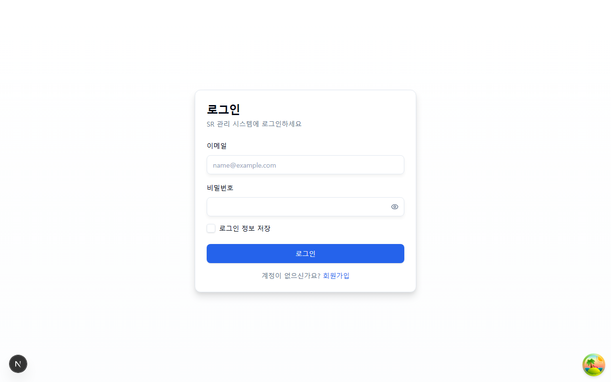
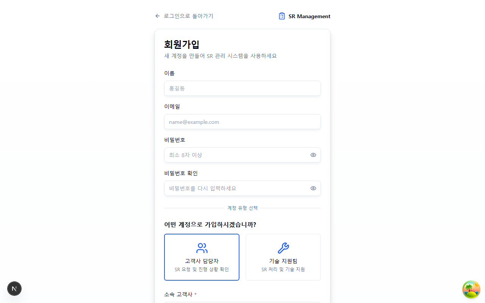
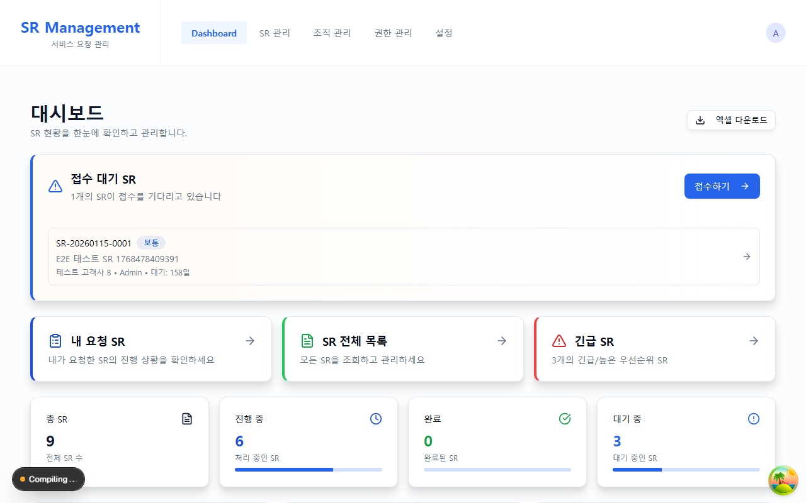
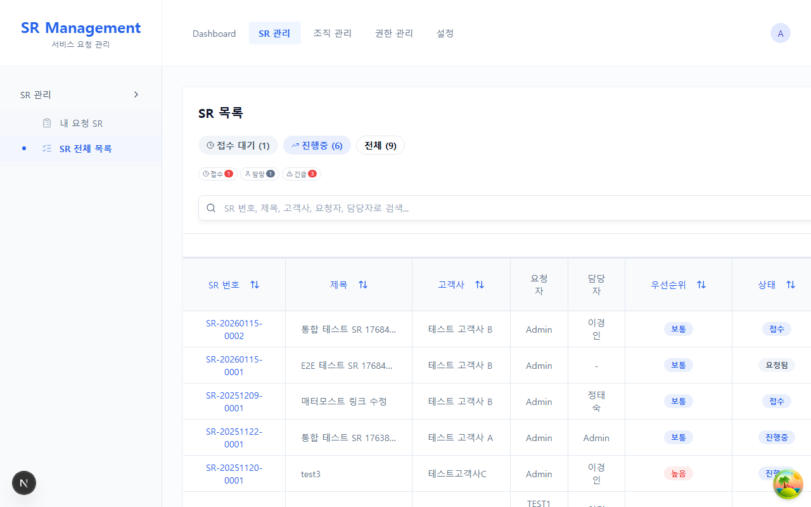
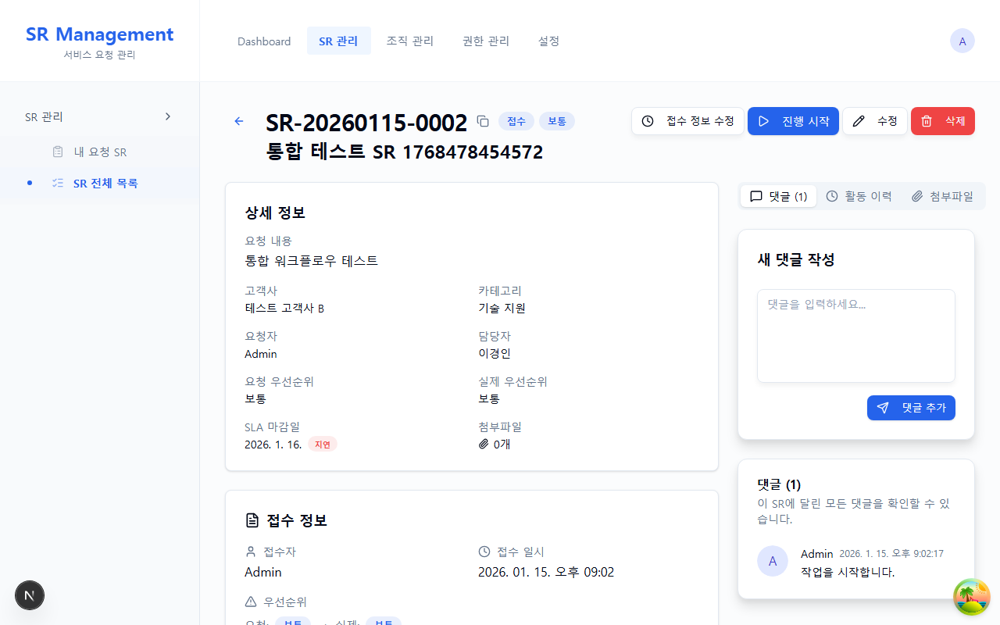
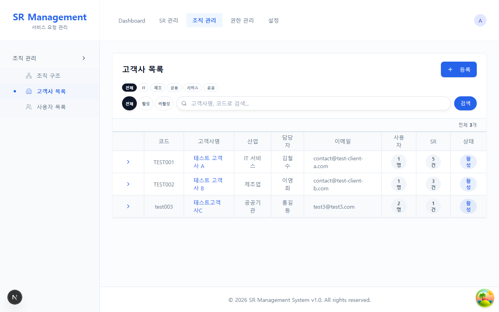
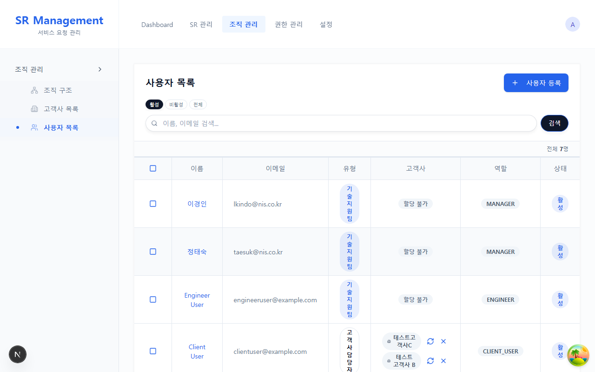
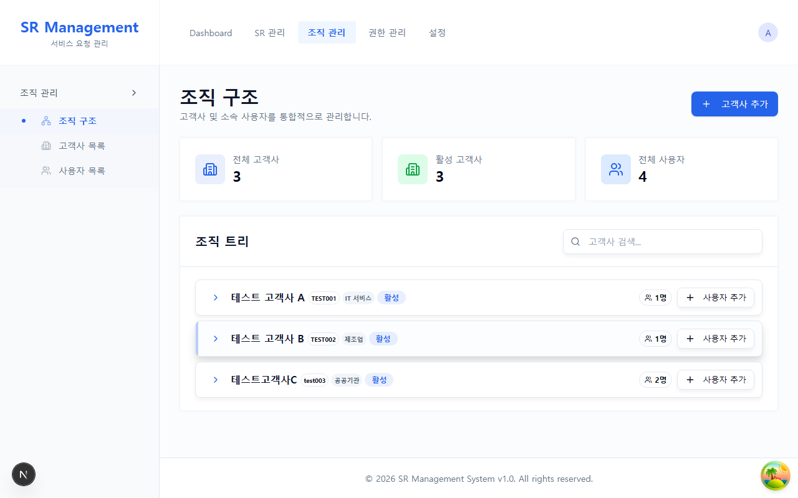
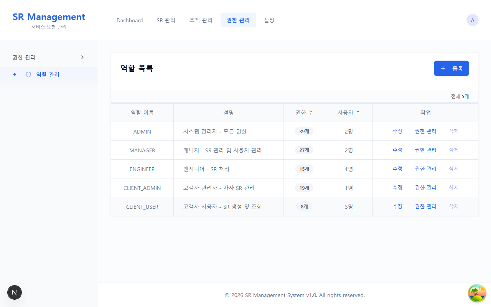
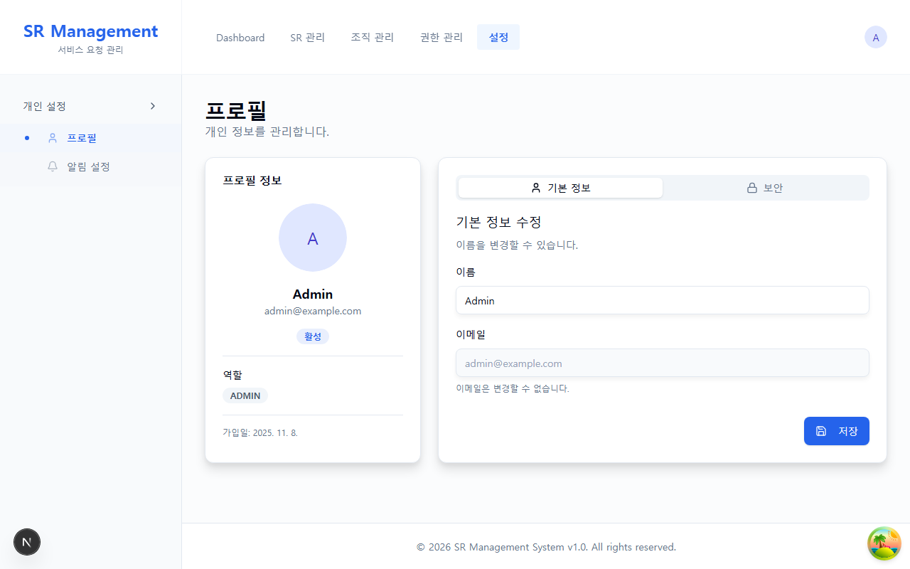

# SR 관리 시스템 사용자·운영 매뉴얼

> 최종 구현 대조일: 2026-08-14
> 이 문서는 현재 코드와 `prisma/schema.prisma`를 기준으로 작성한 정본입니다. 같은 폴더의
> `system_manual.html`과 `system_manual.pptx`는 과거 화면 캡처용 산출물이므로 기능·권한의
> 근거로 사용하지 마십시오.

## 1. 시스템 개요

SR(Service Request) 관리 시스템은 고객 요청의 등록, 접수, 담당자 배정, 처리, 고객 확인을
관리합니다. 모든 읽기·쓰기는 로그인 세션, 역할/권한, 고객사 소속, 담당자 범위를 함께
검사합니다. 화면에서 메뉴가 보인다는 사실만으로 API 권한이 부여되지는 않습니다.

### 역할과 기본 범위

| 역할 | 기본 업무 | 데이터 범위 |
| --- | --- | --- |
| `ADMIN` | 시스템 전체 관리, 역할·권한 관리(역할 부여는 ADMIN만) | 전체 |
| `MANAGER` | SR 접수·담당자 배정·처리, 고객사·사용자 운영 | 전체 SR. 고객 확인(`CONFIRMED`)은 대신 수행할 수 없음 |
| `ENGINEER` | 배정된 SR 처리(접수·배정은 하지 않음) | 자신에게 배정된 SR만 |
| `CLIENT_ADMIN` | 소속 고객사 SR 신청·확인·재오픈, 자사 사용자 관리(조회·가입 승인·비활성화) | 승인된 소속 고객사만 |
| `CLIENT_USER` | SR 등록·조회·고객 확인 | 승인된 소속 고객사만; 일부 화면은 본인 요청만 표시 |

운영 중 역할별 권한을 수정할 수 있으므로 최종 허용 여부는 역할명뿐 아니라 현재의
`RESOURCE:ACTION` 권한과 서버 정책으로 결정됩니다. 외부 역할이 내부 역할을 부여하거나
자신의 고객사 밖 사용자를 관리하는 것은 차단됩니다.

## 2. 로그인과 회원가입

- 로그인 경로는 `/login`이며 이메일과 비밀번호를 사용합니다.
- 비활성 계정은 로그인할 수 없습니다. “6개월 미사용 시 자동 휴면” 기능은 없습니다.
- 비밀번호 변경·관리자 초기화가 성공하면 기존 세션 버전이 올라가므로 이전 세션은 더 이상
  유효하지 않습니다.

회원가입 경로는 `/register`입니다.

- 입력 항목: 이름, 이메일, 비밀번호/확인, 계정 유형(`CLIENT` 또는 `ENGINEER`).
- 비밀번호는 8자 이상이며 영문 대·소문자, 숫자, 특수문자를 포함해야 합니다.
- `CLIENT`는 고객사를 반드시 선택합니다. 계정은 생성되지만 고객사 소속은 `PENDING`으로
  저장되며 승인 전에는 해당 고객사 데이터에 접근할 수 없습니다.
- `ENGINEER`는 비활성 상태로 생성되어 운영자 승인이 필요합니다.
- 이메일 인증, 휴대폰 본인 인증, 부서/팀 선택 기능은 구현되어 있지 않습니다.

## 3. 대시보드

경로는 `/dashboard`입니다. 상태별 현황, 접수 대기, 내 담당 SR, 최근 SR, 처리 시간과 SLA
준수율 등을 표시합니다. `ENGINEER`의 집계와 목록은 자신에게 배정된 SR로 제한되고, 외부
사용자는 승인된 고객사 범위만 볼 수 있습니다.

`ADMIN`, `MANAGER`, `ENGINEER`에게는 CSV 내보내기 버튼이 표시됩니다. 결과는 현재 화면
필터가 아니라 서버가 허용한 전체 범위(`ENGINEER`는 본인 배정분)를 최대 50,000건까지
내보냅니다. 파일은 CSV이며 캐시되지 않습니다.

## 4. SR 목록과 등록

- `/srs`: 권한 범위 안의 SR 전체 목록. 상태, 우선순위, 고객사, 담당자, 날짜와 검색어로
  필터링하고 정렬할 수 있습니다.
- `/my-requests`: 자신이 요청한 SR을 중심으로 보는 목록입니다.
- 페이지 크기는 최대 100건, 페이지 번호는 최대 10,000으로 제한됩니다.
- 목록의 SR 번호나 제목 링크로 상세 화면을 엽니다. 복사 및 접수 버튼은 별도 조작입니다.

새 SR에는 제목, 설명, 고객사, 서비스 카테고리, 희망 우선순위가 필요하며 희망 완료일과
첨부는 선택입니다. 외부 사용자의 고객사는 승인된 소속 범위로 서버에서 다시 고정합니다.
서비스 카테고리도 해당 고객사 전용 또는 공용 카테고리만 허용됩니다.

첨부는 폼 기준 최대 5개, 파일당 10MB입니다. 파일은 웹 공개 디렉터리가 아닌 서버
`STORAGE_DIR`에 UUID 이름으로 저장되며, 인증·SR 조회 권한을 검사하는 다운로드 API로만
받을 수 있습니다. 같은 파일명이 동시에 올라와도 기존 파일을 덮어쓰지 않습니다.

## 5. SR 상세와 상태 전이

상세 화면은 기본 정보, 접수 정보, 공개 댓글/내부 댓글, 첨부, 활동, 상태 이력을 보여 줍니다.
외부 사용자는 내부 댓글과 그 개수조차 받지 않습니다. 물리 저장 경로도 응답에 포함되지
않습니다. 상세의 각 관계 목록은 과도한 단일 응답을 막기 위해 서버 상한이 적용됩니다.

### 상태 흐름

| 현재 상태 | 다음 상태 |
| --- | --- |
| `REQUESTED`(요청됨) | `INTAKE`(접수), `REJECTED`(거절) |
| `INTAKE`(접수) | `IN_PROGRESS`(진행중), `REJECTED` |
| `IN_PROGRESS` | `COMPLETED`(완료), `ON_HOLD`(보류) |
| `ON_HOLD` | `IN_PROGRESS`, `REJECTED` |
| `COMPLETED` | `CONFIRMED`(확인완료), `IN_PROGRESS`(재오픈) |
| `CONFIRMED` | `IN_PROGRESS`(재오픈) |
| `REJECTED` | 전이 없음 |

필수 규칙은 다음과 같습니다.

- `IN_PROGRESS` 전환에는 담당자가 필요합니다.
- `COMPLETED` 전환에는 해결 내용이 필요합니다.
- `REJECTED` 전환에는 거절 사유가 필요합니다.
- `ON_HOLD` 전환에는 보류 사유와 **예상 해제일**이 모두 필요합니다. 보류를 풀면 예상 해제일은
  비워집니다.
- 재오픈에는 재오픈 사유가 필요합니다.
- 재오픈은 7일 이내에만 할 수 있습니다. 기산점은 `COMPLETED`에서 재오픈하면 완료 시각,
  `CONFIRMED`에서 재오픈하면 확인 시각입니다. `CONFIRMED` 인데 확인 시각만 비어 있으면 완료
  시각을 씁니다(창이 넓어지지 않습니다). 두 시각을 모두 확인할 수 없는 SR(레거시 데이터 포함)은
  재오픈을 거부합니다.
- `CONFIRMED`는 그 SR의 신청자 본인만 수행할 수 있습니다. 고객의 요청을 운영자가 대신 등록할
  때는 SR 등록 화면의 **신청자(고객)** 에서 그 고객을 고르세요(대리 등록). 운영자가 자기 이름으로
  등록한 SR은 등록한 운영자 본인 또는 그 고객사의 고객사 관리자(`CLIENT_ADMIN`)가 확인합니다.
- 거절·진행·보류·완료는 운영자(`ADMIN`·`MANAGER`·배정된 `ENGINEER`)만 합니다. 고객사 사용자는
  확인완료와 재오픈만 할 수 있습니다.
- 접수 이후 제목·본문 등 요청 내용은 운영자만 고칩니다. 고객은 접수 전(`REQUESTED`)에만 고칠 수
  있고, 그 뒤 변경은 댓글로 담당자에게 알려 주세요(만족도·추가 의견은 예외).
- **SLA 마감일**은 접수 때 서비스 카테고리 SLA 시간 × 우선순위 배율로 자동 산출됩니다. 운영자는 SR
  상세의 SLA 마감일 옆 **조정**으로 직접 바꿀 수 있으며, 이때 **조정 사유가 필수**이고 마감일을 비울 수는
  없습니다. 직접 조정한 마감일에는 '직접 지정' 표시가 붙고, 이후 우선순위·카테고리가 바뀌어도 자동으로
  다시 계산되지 않습니다. 사유는 감사 기록에 남습니다.
- 상태는 전용 상태 변경 경로에서만 바뀌며 일반 수정 API로 우회할 수 없습니다.
- 동시에 편집한 사용자가 먼저 저장하면 뒤의 요청은 버전 충돌로 거절되므로 새로고침 후
  다시 판단해야 합니다.

### 댓글과 첨부

- 내부 사용자만 내부 댓글(내부 노트)을 작성하고 읽을 수 있습니다. 댓글 입력란 아래 **내부 노트(고객에게
  보이지 않음)** 를 켜고 작성하세요. 내부 노트는 신청자에게 알림이 가지 않고, 고객이 보는 활동 로그에도
  남지 않습니다. 목록에는 '내부 노트' 표시가 붙습니다.
- 외부 사용자는 공개 댓글만 볼 수 있습니다.
- 종결 상태(`COMPLETED`·`CONFIRMED`·`REJECTED`) SR에는 첨부를 추가할 수 없습니다. 첨부 삭제는
  종결 여부와 관계없이 아래 권한으로 판정합니다.
- SR을 삭제해도 첨부 행과 서버 파일은 지워지지 않고 보관됩니다(SR은 논리 삭제). 삭제된 SR의
  첨부는 앱에서 열거나 지울 수 없으므로, 첨부 파일 자체를 지워야 한다면 SR을 삭제하기 **전에**
  첨부부터 삭제해야 합니다. 첨부 삭제는 `ADMIN`·`MANAGER`, 또는 접수 전(`REQUESTED`) SR의
  요청자 본인만 할 수 있습니다.

## 6. 고객사·사용자·조직 관리

`/clients`에서는 이름·코드·산업·연락처·활성 여부를 관리합니다. 고객사별 서비스 카테고리의
SLA 시간은 접수 시 마감일 계산에 사용됩니다. 관련 SR·사용자·전용 카테고리·담당자가 남아
있는 고객사의 파괴적 삭제는 차단됩니다. 고객사 화면(상세의 최근 SR·SR 수, 목록의 SR 건수)은
삭제된 SR을 보여 주지 않지만, 삭제된 SR도 감사 기록으로 남아 고객사를 참조하므로 삭제를
막습니다. 사용자나 SR이 하나도 보이지 않는데 삭제가 막혀 있으면 상세 화면이 삭제된 SR 건수로 그
이유를 알려 줍니다. 더 이상 쓰지 않는 고객사는 고객사 수정 권한이 있으면 비활성화할 수 있습니다.

`/users`에서는 사용자 생성/수정, 활성화, 소속 승인, 역할 부여를 수행합니다(내부 운영 메뉴). 역할
부여는 `ADMIN`만 합니다. 관리자 대상의 민감한 변경·삭제와 자기 자신의 역할 변경도 별도 정책으로
차단됩니다.

고객사 관리자(`CLIENT_ADMIN`)는 **자사 관리 > 자사 사용자**(`/company/users`)에서 자기 고객사
사용자를 조회하고, 가입 신청을 승인·거절하고, 퇴사자 등을 비활성화(또는 다시 활성화)합니다. 사용자
생성과 역할 변경은 운영팀에 요청합니다. 자기 자신은 비활성화할 수 없습니다.

`/organization`은 부서 계층 편집기가 아니라 고객사와 소속 사용자를 트리로 보여 주는 운영
화면입니다. 고객사/사용자 추가, 활성 상태 변경, 사용자 고객사 재배치를 지원하며 진행 중
SR이 있는 재배치는 경고와 재검증을 거칩니다.

`/roles`는 기본적으로 `ADMIN`과 `ROLE:READ` 권한이 있는 사용자에게 제공됩니다. 역할 생성,
수정, 삭제와 권한 카탈로그 매핑을 관리합니다. 행위자가 가진 권한보다 넓은 권한을 새 역할에
부여하거나 보호된 관리자 역할을 비관리자가 변경하는 것은 금지됩니다.

## 7. 개인 설정

- `/settings/profile`: 이름 수정, 현재 비밀번호를 확인한 비밀번호 변경.
  이메일·프로필 이미지·휴대폰·부서는 화면에서 편집하는 항목이 아닙니다.
- `/settings/notifications`: 이메일 및 웹 푸시 이벤트별 수신 설정과 브라우저 푸시 구독 관리.
  매터모스트나 인앱 알림함은 제공하지 않습니다.

알림 대상은 다음과 같습니다. 스위치를 켜도 해당 이벤트의 대상이 아닌 사용자가 알림을 받는
것은 아닙니다.

| 이벤트 | 대상 |
| --- | --- |
| SR 생성 | 활성 `ADMIN`, `MANAGER` |
| SR 담당자 배정 | 새 담당자 |
| SR 상태 변경 | 신청자 — **완료·거절 메일은 설정과 무관하게 항상 발송**(필수 알림) |
| 댓글 추가 | 작성자를 제외한 신청자와 담당자(내부 노트는 담당자에게만) |

완료·거절 알림은 신청자가 처리 결과를 반드시 받아야 하므로 이메일 설정을 꺼도 발송됩니다
(`GEMINI.md` §4). 나머지 상태 변경(접수·진행중·보류·확인완료)만 설정을 따릅니다.

이메일은 SR/댓글 변경과 같은 DB 트랜잭션에 outbox 행으로 함께 기록됩니다. 디스패처가 약
30초 간격으로 발송하며 실패 시 1·5·15·60분 백오프로 최대 5회 시도한 뒤 `FAILED`로 남깁니다.
푸시는 사용자 설정과 브라우저 구독이 모두 활성화되어야 합니다.

**자동 로그아웃**: 30분 동안 조작이 없으면 로그아웃됩니다. 1분 전에 '세션 만료 경고' 창이 뜨며,
**계속 유지**를 누르면 연장됩니다.

## 8. 운영자 점검

### 신규 사용자 승인

1. `/users`에서 비활성 또는 승인 대기 사용자를 확인합니다.
2. `ENGINEER`는 계정을 활성화합니다.
3. `CLIENT`는 요청 고객사가 맞는지 확인한 뒤 소속을 승인합니다.
4. 부여 역할이 사용자 유형과 고객사 경계를 넘지 않는지 확인합니다.

### 이메일 장애

1. **운영 > 알림 발송 이력**(`/settings/outbox`, `ADMIN` 전용)에서 대기·실패 건과 시도 횟수,
   실패 사유를 확인합니다. 시스템 설정 화면의 메일 서버 항목에서 SMTP 자격증명이 설정됐는지도
   봅니다.
2. SMTP 환경 변수와 네트워크를 복구합니다.
3. `NOTIFICATION_DISPATCHER=off`가 설정되어 있지 않은지 확인합니다.
4. 이미 `FAILED`가 된 알림은 원인을 해소한 뒤 같은 화면의 **재발송**으로 다시 보냅니다. 실패
   건만 대기 상태로 되돌아가고 다음 디스패처 주기(약 30초)에 발송됩니다.
5. 화면으로 원인을 알 수 없을 때만 DB 의 `notifications`(`status`, `attempts`, `fail_reason`,
   `next_attempt_at`)를 직접 조회합니다.

### 배포·복구

- 배포 순서, 배포 전 백업, 자동 롤백 조건(마이그레이션 수가 그대로일 때만)과 수동 롤백은
  [SERVER RUNBOOK](./SERVER_RUNBOOK_2026-08-01.md) 5절을 따릅니다.
- 백업 검증과 복구 절차는 [backup-and-restore](./backup-and-restore.md)를 따릅니다.
- 최초 역할/관리자 생성은 [BOOTSTRAP](./BOOTSTRAP.md)을 따릅니다.
- 현재 인메모리 rate limiter는 앱 복제본 1개를 전제로 합니다. 앱을 수평 확장하기 전에
  Redis/PostgreSQL 등 공유 limiter로 교체해야 합니다. 이메일 outbox claim은 다중 워커를
  지원하지만 rate limit 상태는 공유되지 않습니다.

## 9. 현재 제공하지 않는 기능

문서와 구현의 경계를 명확히 하기 위해 미구현 기능을 별도로 적습니다.

- 이메일 주소 인증/인증 링크 재발송
- 휴대폰 본인 인증, 부서·팀 계층 관리, 자동 휴면 계정
- 매터모스트 연동 및 인앱 알림함
- 거절 SR 재제출, 별도의 `REOPENED` 상태
- 사용자별 고정 SLA 표; SLA는 서비스 카테고리별 시간으로 설정

기능·권한의 기술 정본은 `src/lib/policies.ts`(인가 판정), `src/lib/sr-state-machine.ts`(상태 전이),
`prisma/permission-catalog.ts`·`prisma/seed.ts`(권한 카탈로그와 역할별 권한), `prisma/schema.prisma`
입니다. `src/config/navigation.ts` 는 메뉴 표시 여부만 정하며 권한 판정의 근거가 아닙니다.
